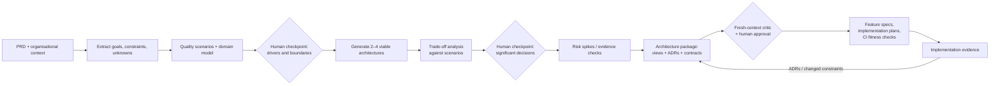
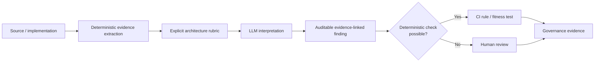

# From PRD to System Architecture: A Research-Backed Design Method for an Architecture-Generating Agent

## Executive summary

The attached brief asks for a reusable agentic skill that sits **after a product requirements document and before feature specifications and implementation plans**. Its job is to create—not review—a system-level architecture: components and responsibilities, domain and data ownership, integration, deployment topology, technology choices, quality-attribute trade-offs, and enough documentation for both humans and downstream coding agents. The existing “architecture critic” remains a deliberately separate fresh-context reviewer. fileciteturn0file1

**The central recommendation is: do not make the agent an autonomous “architect that picks a stack.” Make it an evidence-gathering, option-generating, trade-off-analysing architecture facilitator with explicit human gates.** That position is consistent with established architecture methods and with the strongest 2026 evidence on LLM-assisted architecture. SEI’s Attribute-Driven Design starts from functional requirements, quality requirements, and constraints, while QAW/ATAM methods make quality scenarios and stakeholder priorities explicit. Recent empirical work finds that LLMs can generate useful architectural options, but they lose context, model relationships less reliably than components, accumulate errors through multi-step design, and remain poor substitutes for human architectural judgement. citeturn20view2turn15view6turn15view1turn20view0turn20view1

The recommended operating loop is:



That flow deliberately combines **ADD-style requirements-to-design**, **DDD-style boundary discovery**, an **ATAM-inspired—not falsely labelled “full ATAM”—trade-off step**, and an evolutionary feedback loop. Formal ATAM is stakeholder-intensive and intended to expose risks, sensitivity points, and trade-offs; it is not simply a scoring prompt that an LLM can perform alone. citeturn20view2turn15view6turn20view1

Three evidence labels are used throughout this report:

**Established** means supported by standards, SEI methods, mature architecture practice, or well-established engineering guidance. **Emerging** means recent empirical work—especially 2026 LLM research—whose generality is not yet established. **Recommendation** is the synthesis proposed here rather than a claim of universal best practice.

The resulting skill should have six defining properties.

| Property | Recommendation |
|---|---|
| **Requirements-driven** | Every architecturally significant decision traces to a business goal, constraint, quality scenario, domain boundary, or known risk rather than to a fashionable pattern. **Established / Recommendation.** citeturn20view2turn20view7 |
| **Multi-option** | For significant choices, generate alternatives including a deliberately simple option, state forces, and explain why alternatives lose. This turns the LLM’s useful option-generating behaviour into an asset without delegating final judgement to it. **Emerging / Recommendation.** citeturn15view1 |
| **Human-gated** | Humans validate business priorities, domain semantics, risk tolerance, team/organisational constraints, irreversible decisions, and final acceptance. **Emerging.** citeturn15view1turn20view1 |
| **Right-sized** | Default to the least distributed architecture that satisfies known drivers; increase architectural machinery only when a concrete quality scenario or organisational boundary pays for it. **Recommendation**, supported by the known operational costs of distributed services. citeturn7search0turn7search2turn7search6turn14search17 |
| **Evidence-dated** | Technology recommendations must be re-researched from current official sources at design time, with versions/support status, maturity, security, operational fit, team fit, and evidence date recorded. **Recommendation.** CNCF, OpenSSF and SLSA provide useful—but not sufficient—signals of maturity and supply-chain posture. citeturn19view0turn19view1turn19view2 |
| **Executable where possible** | Translate expensive architectural boundaries into fitness/conformance checks in CI so the written design is tested against implementation rather than merely remembered. **Established / Recommendation.** citeturn19view7turn17search0turn17search1 |

The brief does **not** specify a budget, delivery deadline, regulatory regime, cloud/provider, team size, expected traffic, availability objective, data classifications, existing stack, or organisational topology. Those remain unknown rather than being invented. fileciteturn0file1 Consequently, this report does not fabricate dollar costs or universal project durations. One useful external scale reference is that the SEI’s full ATAM process is a substantive multi-stakeholder evaluation rather than a lightweight prompt; for most ordinary product work, the proposal below uses a proportional “ATAM-like” decision review instead of requiring formal ATAM. citeturn15view6

## Brief extraction, research questions, assumptions, and method

**Extracted brief.** The desired capability accepts a PRD and creates the high-level architecture of a whole application or system. Its output must cover structural decomposition, responsibilities, data and ownership, communication and integrations, deployment, technology choices and the quality attributes driving those choices. The document must be reviewable by people and sufficiently explicit to constrain downstream agents. The research must address process, right-sizing, significant decisions, documentation, technology selection, evidence for LLM architecture generation, post-June-2026 developments, failure modes, and upstream/downstream contracts. Reviewing an already-written architecture, low-level class/function design, and cloud-specific infrastructure-as-code are expressly out of scope. fileciteturn0file1

The brief implies a particularly important requirement: **the artefact is not just explanatory documentation; it is an interface between agents.** A vague “we will use a scalable service-oriented architecture” is therefore worse here than it might be in a slide deck. A downstream implementation agent needs explicit ownership and dependency rules, allowed communication paths, invariants, external contracts, chosen technologies, open decisions and validation criteria.

**Clarified research questions.** I interpreted the seven questions in the brief as four deeper questions:

1. What repeatable transformation converts incomplete product intent into a defensible architecture?
2. Which decisions require judgement, and what evidence should an agent assemble before making or escalating them?
3. What minimum set of machine-readable architecture artefacts keeps downstream implementation constrained without creating documentation bureaucracy?
4. Given 2026 evidence, where is LLM autonomy credible and where should deterministic tooling or humans remain authoritative?

No assumption was made that the target product is a web application, uses TypeScript, runs in cloud infrastructure, needs microservices, uses Kubernetes, needs event sourcing, or has Internet scale. Those examples in the brief are treated as decisions to be justified, not implied requirements. fileciteturn0file1

**Research method.** Sources were prioritized in roughly this order: architecture standards and SEI material; original/official methodology documentation; peer-reviewed and primary academic work; official technology/tool documentation; then reputable practitioner and cloud architecture guidance. Research was current through **October 2, 2026**. The architecture baseline included SEI ADD, QAW and ATAM; ISO/IEC/IEEE architecture-description/evaluation standards; ISO/IEC 25010 quality modelling; DDD boundary guidance; C4, arc42 and ADR source material; NIST security architecture; official OpenTelemetry documentation; cloud-provider distributed-system guidance; and current primary research on LLM architecture generation and conformance. citeturn20view2turn15view6turn19view8turn20view7turn15view8turn20view4turn15view9turn16search7turn16search13

ISO/IEC/IEEE 42010 is especially useful as a guardrail: architecture descriptions should be organised around stakeholder concerns, viewpoints and models, but the standard deliberately does not require a particular notation or tool. That argues against making “produce UML” or “produce C4” the agent’s fundamental goal. The real requirement is to make relevant concerns and decisions legible; diagram type follows the concern. citeturn19view8

ISO/IEC 25010:2023 provides a current quality model for eliciting and evaluating product quality and explicitly positions such a model as useful for requirements definition, design objectives, testing objectives and acceptance criteria. It is therefore a good **checklist to prevent omission**, but not a requirement to optimise every listed characteristic. citeturn20view7

The most important evidence limitation is the maturity of the LLM literature. The 2026 evidence base has improved substantially, but much architecture-generation research remains preprint-scale or benchmark-scale rather than longitudinal industrial evidence. The peer-reviewed IEEE Software study by Cervantes, Cai and Kazman is notably conservative: models generated relevant options, yet architects often disagreed with or distrusted them because of missing context and inconsistency; the authors position LLMs as assistants rather than final decision-makers. citeturn15view1

## A PRD-to-architecture method

A useful architecture agent should behave less like “one enormous prompt” and more like a staged compiler with validation boundaries. Each phase should have an explicit input, output, evidence test and escalation condition.

| Stage | Input | Agent work | Output | Human checkpoint |
|---|---|---|---|---|
| **Intent extraction** | PRD, business context, existing constraints | Separate goals, functional scope, actors, external systems, explicit constraints, assumptions and unknowns; preserve requirement IDs where available. | `architecture-input.md` or structured equivalent; requirement/unknown register. | Only required when ambiguity materially changes architecture. |
| **Quality-attribute elicitation** | Extracted requirements | Turn “fast”, “secure”, “reliable”, etc. into observable scenarios; identify conflicting qualities and missing measures. Use ISO 25010 as an omission checklist. | Prioritised quality scenarios and provisional success measures. | **Required:** stakeholders own priorities and acceptable trade-offs. citeturn0search11turn0search13turn20view7 |
| **Domain discovery** | Requirements, terminology, workflows | Draft ubiquitous-language glossary, business events/capabilities, bounded-context candidates, context relationships and authoritative data ownership. | Domain/context map with uncertainties. | **Required for non-trivial domains:** business experts validate semantic boundaries. citeturn5search0turn20view1 |
| **Architecture-driver selection** | Scenarios, constraints, domain model | Identify the small subset of requirements and constraints that materially shape structure; distinguish must-have from speculative future concern. | Driver register with traceability. | Human confirms priorities/risk appetite. citeturn20view2 |
| **Option generation** | Drivers | Generate genuinely different viable structures and tactics, including the simplest plausible design; identify prerequisites and reversibility. | Alternatives table. | Usually asynchronous review; mandatory for high-cost/irreversible choices. |
| **Trade-off evaluation** | Alternatives + scenarios | Run scenario-by-scenario analysis; identify sensitivity points, trade-offs, failure modes, operational implications and uncertainty. | Decision matrix and candidate ADRs. | **Required:** humans accept major trade-offs. This is ATAM-inspired, not a claim that an LLM has performed ATAM. citeturn15view6turn20view6 |
| **Risk retirement** | Highest-uncertainty decisions | Research current docs; prototype representative risks; benchmark where performance matters; test integration/security constraints. | Spike evidence and revised decisions. | Human accepts evidence or reopens decision. |
| **Architecture synthesis** | Accepted decisions | Produce views, responsibilities, data ownership, APIs/events, deployment assumptions, ADRs, quality scenarios, risks and rules. | Versioned design package. | Architecture owner signs off significant decisions. citeturn15view8turn15view9turn20view4 |
| **Independent challenge** | Completed package | Give the artefact, not the producing agent’s hidden context, to the existing architecture critic; test requirement coverage and contradictions. | Review findings and disposition. | Human decides unresolved findings. |
| **Conformance handoff** | Accepted architecture | Encode high-value structural constraints and quality targets in CI/observability; connect ADRs to rules. | Fitness tests, dependency rules, dashboards/checks. | Team changes architecture deliberately when reality invalidates it. citeturn19view7turn17search0 |

**Requirements first.** The agent should begin by distinguishing four things that PRDs commonly blur: *required behaviour*, *business outcomes*, *architectural constraints*, and *suggested implementation*. “Must integrate with enterprise SSO” is different from “use vendor X,” and “support rapid onboarding of acquired subsidiaries” may be more architecture-significant than dozens of UI requirements. ADD explicitly begins with functional requirements, quality requirements and constraints because architecture is shaped by all three. citeturn20view2

**Turn adjectives into scenarios.** “Scalable”, “available”, “secure”, “maintainable”, and “fast” cannot drive a useful trade-off until the system knows *under what stimulus, in what operating situation, what response is expected and how success is judged*. SEI’s QAW exists specifically to surface and prioritise quality-attribute scenarios with stakeholders before architecture is fixed; ATAM later uses scenarios to expose architectural risks and trade-offs. citeturn0search11turn0search13turn15view6

An agent can draft scenarios aggressively. It should **not invent the acceptance threshold**. For example:

> PRD: “The service must be highly available.”  
> Agent draft: “During loss of one production compute instance, authenticated read operations continue within ___ seconds/minutes, with at most ___ unavailable requests.”  
> Human obligation: fill or consciously waive the blanks.

That makes missing product decisions visible rather than silently replacing them with model priors.

**Model the domain before picking process boundaries.** Fowler’s description of bounded contexts emphasises that different parts of a large domain may require different models and vocabularies, with relationships made explicit through a context map. A bounded context is primarily a semantic/model boundary; it is not automatically a microservice. citeturn5search0turn5search2 This distinction is crucial for an agent: it can use domain boundaries to create a **modular monolith** just as legitimately as to propose services.

The 2026 DDD automation study provides unusually direct evidence for where a human gate belongs. Its five-stage prompting flow progressed from ubiquitous language to event storming, bounded contexts, aggregates and technical architecture. Early stages produced useful artefacts, but small inaccuracies propagated until later technical-design stages became impractical; the authors explicitly recommend the LLM as a collaborative sparring partner rather than full automation. citeturn20view1 Thus the architecture skill should stop after proposed bounded contexts and ask for semantic validation on consequential domains **before** turning them into technical structure.

**Select drivers, not every requirement.** The agent then asks: which scenarios actually force architecture? A copy change does not. “All EU customer data must remain in-region” may. “One reporting query takes five seconds” may not. “Every transaction requires <100 ms p99 while a dependency is degraded” probably does. ADD formalises this idea by using quality attributes and requirements to drive recursive architectural decisions rather than designing every detail up front. citeturn20view2

**Generate alternatives before becoming attached to one.** For each large decision, the agent should produce at least a *simplest viable*, a *more decoupled/scalable*, and, where relevant, a *managed/buy* option. This is particularly well matched to the demonstrated strengths of LLMs: the 2026 peer-reviewed study found them useful for generating design options and as a sounding board even where human architects retained final decision authority. citeturn15view1 A proposed architecture without rejected alternatives is therefore incomplete for architecturally significant decisions.

A decision record should look approximately like:

| Field | Example form |
|---|---|
| Driver | “Teams A and B require genuinely independent deployment.” |
| Options | Modular monolith; two services; event-driven services. |
| Evidence | Team topology, release coupling measurements, relevant platform capabilities. |
| Quality effects | Deployability ↑, operational complexity ↑, consistency complexity ↑. |
| Decision | Option B. |
| Why not A/C? | Explicit reasoning. |
| Confidence | High / medium / low, with reason. |
| Reversibility | Easy / costly / effectively irreversible. |
| Validation | Spike or production measure that would falsify the choice. |

That aligns with ADR practice: a record captures a significant decision, its context/rationale and consequences rather than merely logging “we chose PostgreSQL.” citeturn15view9

**Use ATAM as a reasoning shape, not an LLM badge.** ATAM evaluates how architectural approaches interact with business and quality goals, producing risks, sensitivity points, trade-offs, scenarios and a utility tree; the method involves architecture presentation, business drivers and stakeholder participation. citeturn15view6 The agent can automate scenario matrices, contradiction discovery and preparation. It cannot supply stakeholder priorities from nowhere. Calling a single-model self-review “ATAM” would therefore be misleading.

**Retire uncertainty with a spike.** A design should explicitly classify claims as *known*, *assumed*, or *needs evidence*. When a decision is both high impact and low confidence—database throughput, SDK capability, cold-start latency, cross-region guarantees, browser limitations, vendor feature semantics—the appropriate output may be a time-boxed spike rather than an architectural assertion. This also protects against a recurring LLM failure mode: producing fluent certainty where real engineering evidence is absent.

The design process terminates not when every technical question has been answered, but when **the system’s consequential boundaries and contracts are stable enough that remaining uncertainty can be safely delegated to feature-level design**.

## Significant decisions, defaults, and right-sizing

The table below uses “default” in a deliberately narrow sense: **what the agent should propose in the absence of a requirement that forces complexity**. Defaults are starting hypotheses, never rules that override evidence.

| System-level decision | Forces that should decide it | Sensible starting default | Upgrade trigger / red flag |
|---|---|---|---|
| **Decomposition** | Domain boundaries; independent deployment; team ownership; different scaling/failure requirements; change coupling. | **Recommendation:** one deployable with explicit modules/boundaries for a new single-team or tightly coupled product. Do not infer services merely from bounded contexts. | Services become justified when independence creates material value. Red flag: service boundaries that still require coordinated releases or shared internals. Microservices impose distributed operations, networking, monitoring and deployment costs. citeturn7search0turn7search2turn7search6turn14search17 |
| **Domain/data ownership** | Business semantics, write authority, privacy, consistency, lifecycle, reporting. | One explicit authoritative owner for each business fact/entity; permit read models/copies with declared freshness semantics. | Shared mutable persistence across supposedly autonomous services; two writers with no conflict model; ownership implied by table location rather than domain responsibility. citeturn14search4turn5search0 |
| **Storage** | Access patterns, transactions, data shape, search/graph/time-series needs, retention, scale, operational competence. | **Recommendation:** minimise the number of persistence technologies and select against demonstrated workload needs; do not choose polyglot persistence for prestige. | A chosen store cannot satisfy an explicit driver; specialised access patterns have measured need. Red flag: datastore selected before data/query/consistency requirements. |
| **Synchronous vs asynchronous communication** | Does caller require immediate answer? Availability coupling, latency, fan-out, buffering, workflow duration, failure recovery. | Synchronous request/response for immediate queries/commands inside tolerable availability coupling; async messaging/events where temporal decoupling, fan-out or load levelling is a real requirement. | Red flag: long chains of synchronous services; or events used for every interaction despite need for immediate consistency. Async designs require ordering/idempotency/failure semantics to be explicit. citeturn14search0turn14search1turn14search16 |
| **Consistency and cross-boundary transactions** | Business invariants, loss tolerance, concurrency, latency, partition/failure behaviour. | Keep strong transactional invariants inside the data owner where feasible; specify where stale reads are acceptable rather than saying “eventually consistent” globally. | Distributed invariant spans independent stores. Saga/compensation is appropriate only where the business operation can actually be compensated; it introduces isolation/anomaly concerns. citeturn14search4turn14search5 |
| **Event sourcing/CQRS** | Need for full history, temporal reconstruction, event replay, independent read/write models, audit semantics. | **Recommendation:** conventional state persistence unless those requirements justify the additional model and operational burden. | Red flag: event sourcing chosen merely because the architecture is “event driven.” AWS similarly cautions that CQRS is best targeted rather than indiscriminately applied. citeturn6search5 |
| **Identity and authorisation** | User/service identities, tenancy, trust boundaries, regulatory controls, federation, privileged operations. | Centralise identity policy using established identity protocols/providers where constraints permit; make authentication and authorisation boundaries explicit. | Red flag: network location treated as trust, inconsistent per-service identity semantics, bespoke credential/crypto schemes. NIST zero-trust guidance emphasises per-request, least-privilege decisions and identity beyond network location. citeturn16search7turn16search9turn16search21 |
| **Front-end rendering model** | Public discoverability/SEO, initial-render latency, interaction intensity, browser APIs, offline needs, data sensitivity, infrastructure. | **Recommendation:** choose rendering per route/workload rather than declaring an entire product “SSR” or “CSR”; keep client-side execution for interactions/browser capabilities that require it. Current server/client frameworks explicitly support mixed boundaries. citeturn16search0turn16search1turn16search22 | Red flag: rendering choice inherited from framework fashion rather than user/performance/security needs. |
| **Front-end decomposition** | Team autonomy, independent release, end-to-end ownership, shared UX, bundle/runtime cost. | One application shell/repository boundary model for a cohesive team. | Micro-frontends become plausible when separate teams genuinely need independent end-to-end ownership and shipping. Red flag: one team splitting its UI into runtime micro-frontends with heavy cross-app state coupling. citeturn16search8 |
| **Front-end state** | Server-vs-client source of truth, URL-addressability, local interaction scope, collaboration/offline semantics. | **Recommendation:** keep server state, navigation state and local UI state conceptually separate; minimise globally mutable client state. | Global store becomes an implicit integration bus; copies of authoritative backend state have no refresh/invalidation model. |
| **Deployment topology/environments** | Availability zones/regions, isolation, compliance, scaling, release model, operational staff, recovery. | **Recommendation:** least-complex managed deployment shape satisfying scenarios. Treat containers, orchestration and Kubernetes as implementation responses, not signs of architectural maturity. | Requirements for heterogeneous workloads, independent scaling/release or platform-level policy may justify more machinery. Microservices in particular presuppose strong deployment/monitoring competence. citeturn7search2turn14search17 |
| **Observability** | SLOs, debugging across boundaries, security/audit, cost, support model. | Define observable failure modes with the architecture. For distributed systems, preserve correlation and use vendor-neutral telemetry conventions where practical. OpenTelemetry standardises collection/export of traces, metrics and logs. citeturn16search13 | Red flag: adding distributed components without trace/correlation strategy; dashboards unrelated to quality scenarios. |
| **Security boundaries** | Assets, actors, data classifications, service/user identities, threat model, tenancy, network exposure. | Identify trust boundaries and protect resources rather than equating “inside network” with trusted. Apply least privilege and explicit authN/authZ across meaningful boundaries. citeturn16search5turn16search9 | Red flag: security is a final section with no effect on decomposition or data flows. |
| **Build vs buy** | Differentiation, integration fit, compliance, data control, total ownership, operational burden, portability, vendor viability. | **Recommendation:** strongly consider buying commodity capabilities where building them creates risk without product differentiation, but record lock-in, exit and data implications. | Red flag: “we can build it in a week” ignores lifetime operation; inverse red flag: vendor adopted without exit/security/SLA analysis. |

The most consequential default is **“distribution must earn its cost.”** Fowler’s microservices writing stresses an operational premium and notes that many successful microservice stories began with monolithic applications; prerequisite capabilities include automated deployment, rapid provisioning, monitoring and close development/operations collaboration. Microsoft’s architecture guidance similarly lists network latency, eventual consistency, data integrity, versioning and observability among service-architecture challenges. citeturn7search0turn7search2turn14search17

That does **not** mean “always build a monolith.” Independent deployment, fault isolation, independent scaling, regulatory isolation or durable team ownership can absolutely justify services. The point is causal: the document should be able to say *which driver paid for each process/network boundary*. If no driver can be named, the boundary is probably speculative.

The same principle applies to **micro-frontends**. Their core justification is independent feature ownership by autonomous teams. Without that organisational requirement, runtime UI decomposition commonly adds integration surfaces without obtaining the autonomy benefit it was created for. citeturn16search8

**Right-sizing the architecture package.** C4 explicitly says that system-context and container diagrams are sufficient for many software teams; more detailed component/code views should be used only when they add value. arc42 likewise offers both a complete twelve-section structure and a lighter single-page canvas. citeturn15view8turn20view4 Those observations support adaptive documentation rather than one architecture template with mandatory empty sections.

| Scale | Typical condition, not company-size proxy | Recommended design depth | What to omit unless forced |
|---|---|---|---|
| **Small** | Internal tool; one owning team; low integration/operational complexity; limited blast radius. | One short design document: scope/constraints, 3–5 important quality scenarios, system context, one container/module view, data ownership, auth/trust boundary, deployment shape, major ADRs/open questions. **Recommendation.** | Component diagrams for every module, service mesh, elaborate event taxonomy, platform abstractions, multi-region plans with no requirement. |
| **Medium** | Product application with meaningful external integrations, production SLOs, sensitive data or several substantial domains. | Context + container views; context/domain map; important dynamic sequence(s); data ownership/consistency matrix; deployment view; prioritised quality scenarios; ADRs; observability/security posture; selected fitness functions. | Full arc42 treatment where sections add no stakeholder value; premature team-scale distribution. |
| **Large** | Multi-team platform, regulated/critical product, many independently evolving domains, complex topology or significant operational risk. | Explicit viewpoints/stakeholder concerns; domain/context map; multiple C4/static/dynamic/deployment views; detailed quality scenarios; systematic alternatives; formalised decision log; threat/security architecture; data governance; deployment/failure model; fitness functions; possibly a facilitated QAW/ATAM-style evaluation. citeturn19view8turn15view6 | Low-level class design in the system architecture; exhaustive diagrams with no identified audience/concern. |

The levels should be triggered by **architectural entropy**, not simply “number of users”. A ten-user treasury system handling valuable credentials can require more security architecture than a public site serving millions of static pages. Similarly, a three-team platform may need more explicit ownership and compatibility contracts than a high-traffic system maintained by one tightly coupled team.

The test for over-engineering is straightforward:

> **For every added architectural mechanism, name the requirement, quality scenario, organisational boundary or measured risk it addresses.**

The complementary test for under-engineering is:

> **For every important state transition and external dependency, explain ownership, failure behaviour, consistency, security boundary and observability.**

Together, those two questions catch both “Kubernetes because senior engineers use Kubernetes” and “one giant database/API because we can refactor later.”

## Documentation, diagrams, and technology selection

The minimum useful architecture package should be **small enough to stay current, structured enough for another agent to parse, and explicit enough to distinguish decisions from illustrations**.

A strong default is a version-controlled directory such as:

```text
architecture/
  system-design.md
  decisions/
    ADR-001-...
    ADR-002-...
  diagrams/
    context.*
    containers.*
    critical-flow.*
    deployment.*
  constraints/
    architecture-tests.*
  evidence/
    spike-*.md
```

**Recommendation:** `system-design.md` should contain, in order:

1. purpose, scope and non-goals;
2. business/architectural drivers;
3. assumptions, constraints and unresolved questions;
4. prioritised quality scenarios;
5. domain boundaries and terminology;
6. system context;
7. container/module responsibilities;
8. authoritative data ownership and consistency rules;
9. important runtime interactions and failure behaviour;
10. identity/security/trust boundaries;
11. deployment topology and environment assumptions;
12. observability and operational model;
13. technology selections with current evidence;
14. significant decisions and links to ADRs;
15. fitness/conformance rules;
16. risks, deferred decisions, and conditions that reopen decisions.

For a small system, most of those can be a sentence or compact table; for a large system they become full views. This is compatible with arc42’s principle that documentation should include what stakeholders need rather than filling a template mechanically. arc42’s current material explicitly supports docs-as-code in Markdown/AsciiDoc and Git review. citeturn20view4

**C4 should be the default structural vocabulary, not the only diagram vocabulary.** C4’s hierarchy separates system context, containers, components and code; its own guidance says context and container diagrams suffice for many teams. citeturn15view8 For this skill, “container” must be explained carefully to agents: in C4 it means an executable/deployable application or data store, not necessarily a Docker container.

Use diagrams according to the question being answered:

| Question | Best starting view | Notes |
|---|---|---|
| Who uses this system and what external systems matter? | **C4 System Context** | Mandatory for almost every non-trivial design. citeturn15view8 |
| What are the major executable/data responsibilities? | **C4 Container** | Usually the principal system-design diagram. citeturn15view8 |
| Where are domain boundaries and dependencies? | **Context map / module map** | Show ownership and relationship semantics, not just boxes. DDD makes bounded-context relationships explicit. citeturn5search0 |
| How does a critical use case cross boundaries? | **Sequence/dynamic diagram** | Use only for flows whose ordering/failure/consistency matter. |
| Where does software run and what fails independently? | **Deployment diagram** | Add when topology affects quality attributes. |
| What are the trust zones and sensitive flows? | **Data-flow / threat-oriented view** | Prefer a security-specific view over colouring a generic diagram. NIST’s architecture guidance emphasises resource and identity boundaries. citeturn16search7turn16search9 |
| What are the internals of a particularly complex container? | **C4 Component** | Add selectively, not universally. citeturn15view8 |

For **notation/tooling**, text-based diagrams are a good fit for agentic workflows because they are diffable, reviewable and can be validated/rendered in CI. Structurizr’s model-as-code approach separates an architectural model from generated views; Mermaid provides text-based architecture and sequence syntax; D2 is another declarative diagram language. citeturn20view5turn19view5turn19view6

My practical choice would be:

- **Mermaid** for sequence diagrams and uncomplicated one-off flows because it embeds naturally in Markdown. Its generic architecture-diagram support is now official, although Mermaid’s C4-specific syntax has historically been labelled experimental, so do not make Mermaid-C4 syntax your canonical semantic architecture model. citeturn19view5turn10search8
- **Structurizr DSL** where maintaining a coherent C4 model across many views matters. One model can generate multiple views, which is preferable to asking an agent to redraw the same system independently several times. citeturn20view5
- **D2** where flexible, high-quality declarative diagrams are wanted without committing to C4 semantics. citeturn19view6

A noteworthy current change is that **Structurizr’s hosted cloud service reached end of life on September 30, 2026**; the project’s local/server tooling remains the relevant path for teams adopting it now. A skill created in October 2026 should therefore not blindly prescribe the old cloud workflow from model memory. citeturn15view10 That is a useful example of why technology selection must use current sources.

**ADRs are the semantic spine.** ADRs should cover decisions whose reversal would be expensive or whose rationale future builders are likely to question: decomposition, persistence, consistency, authentication, major frameworks/platforms, cross-service communication, tenancy, rendering, and similarly consequential choices. The ADR community describes an ADR as a record of a significant architectural decision and its context/consequences; common formats include status, context, decision and consequences, while richer formats include considered options and trade-offs. citeturn15view9

The skill should **not** generate an ADR for every library. A useful heuristic is: create one when a future engineer could reasonably ask “why are we constrained this way?” and the answer materially affects the system.

**Fitness functions close the design-to-code loop.** Thoughtworks describes architectural fitness functions as objective measures that provide feedback about whether architecture is moving toward desired qualities. Structural dependency tests are a concrete form of this. citeturn19view7 For Java, ArchUnit can enforce package/class dependencies, layers, slices and cycle constraints directly inside ordinary tests; its current user guide is at 1.5.1, and the project released 1.5.0 on August 4, 2026. citeturn17search0turn17search1

Examples of architecture decisions worth making executable include:

```text
Domain modules must not import infrastructure adapters.
Feature A may consume Feature B only through B's public API.
No circular dependency may exist among bounded-context packages.
PII may only be persisted by the Customer Data owner.
Every service-to-service request must propagate a correlation context.
p95/p99 latency and error-rate targets corresponding to accepted
quality scenarios must be observable in production.
```

Not every statement is enforceable by one static-analysis tool. The important separation is:

**deterministic check when possible → measurable production check when necessary → human/LLM review only where judgement is inherently semantic.**

That hierarchy is safer than making the LLM the universal architecture judge.

**Technology selection should be a research workflow.** The agent should never answer “What database/framework/message broker should we use?” from pretrained popularity alone. It should first derive capabilities and constraints, then gather dated evidence for a small candidate set.

A selection record should score or narratively compare:

| Evidence category | Questions |
|---|---|
| **Requirement fit** | Does it satisfy the concrete workload, consistency, latency, deployment, security and ecosystem requirements? |
| **Current support** | Current stable release? Maintenance cadence? Supported runtime versions? Published EOL/deprecation plan? |
| **Operational fit** | Can this team deploy, observe, recover, upgrade and debug it with current platform capabilities? |
| **Security/supply chain** | Security policy/advisories? Provenance? Dependency posture? OpenSSF Scorecard can supply repository-level security signals; SLSA provides an integrity/provenance framework. citeturn19view0turn19view1 |
| **Maturity** | Production adopters, governance, maintainers, documented upgrade policy, ecosystem maturity. For CNCF projects specifically, Sandbox/Incubating/Graduated status encodes increasing maturity backed by due-diligence processes, but it is only one input. citeturn19view2 |
| **Team fit** | Existing expertise, hiring/support availability, cognitive load and compatibility with existing tooling. |
| **Economics** | Licence, infrastructure, people/operations, migration and exit costs—not just sticker price. |
| **Reversibility** | How hard is replacement? What data/protocol/API becomes proprietary? |
| **Spike result** | Did a representative implementation prove the claims that actually matter? |

The architecture agent should **date every externally researched technology claim**. “Framework X is mature” is not an enduring architectural fact. “As checked on 2026-10-02, version/support/security sources show X meets constraints A/B/C” is reviewable evidence.

For expensive choices, the shortlist should then be tested with a **representative spike**, not a hello-world example. A database spike should exercise the difficult query/transaction; a message broker spike should exercise redelivery/idempotency; an identity provider spike should prove tenancy/claims/logout/provisioning; a rendering framework spike should exercise the actual caching/auth/data boundary.

## Agents, failure modes, and what changed since June 2026

The evidence available by October 2026 supports **assisted architecture generation**, not autonomous architecture authority.

The strongest direct peer-reviewed evidence located is Cervantes, Cai and Kazman’s 2026 IEEE Software paper. Across architecture design problems, LLMs produced relevant options, but human architects often disagreed with or distrusted their suggestions because context was missing and outputs were inconsistent. The paper’s practical conclusion is that humans remain final decision-makers while models are useful for alternatives, sounding-board work, creativity and education. citeturn15view1

A separate requirements-to-architecture benchmark, **R2ABench**, currently contains 68 projects with structured requirements, human-validated reference architecture views and source requirements. Its July 7, 2026 revision reports an especially relevant asymmetry: current systems identify components substantially better than they recover relationships; hallucinated edges are the dominant structural failure, and even structurally plausible output can miss requirement coverage and traceability. citeturn20view0

That finding should directly change the skill design. **Do not ask the model merely for boxes. Make every important connector earn itself.** Each edge should carry something like:

```yaml
source: Orders
target: Payments
interaction: authorize payment
mode: synchronous request/response
data: payment-intent-id, amount, currency
failure_semantics: order remains pending; retry policy ...
requirement_refs: [PAY-12, REL-04]
decision_ref: ADR-007
```

This converts the model’s weakest area—relationships—into an explicit review surface.

A March 2026 study of automated architecture-view generation is also revealing. Across 340 open-source repositories and 4,137 generated views, a specialised architecture agent outperformed a general-purpose coding agent, but even the best approaches had persistent granularity problems: models tended to operate at code-level rather than architectural abstraction. The custom agent achieved a reported 22.6% clarity-failure rate and 50% success on appropriate level of detail in that experimental setup. The work is a preprint and partially relies on LLM-based evaluation, so its exact metrics should not be generalised beyond the experiment; its qualitative warning about abstraction mismatch is nevertheless highly relevant. citeturn15view3

The DDD study reinforces a second failure mode: **error accumulation**. Glossaries and bounded-context candidates were useful, but mistakes compounded through aggregate and technical-architecture stages. citeturn20view1 This argues for checkpointed stages with fresh validation rather than a single context that carries every provisional inference forward as fact.

The major agent-specific failure modes and defences are therefore:

| Failure mode | Evidence / mechanism | Defence in the proposed skill |
|---|---|---|
| **Missing-context confidence** | LLM architects give plausible options despite lacking organisational/business context; humans often distrust or disagree with such suggestions. citeturn15view1 | Assumption/unknown register; no silent completion of missing constraints; human gates on business trade-offs. |
| **Invented or wrong relationships** | R2ABench reports edge recovery materially weaker than component identification and edge hallucination as a dominant structural failure. citeturn20view0 | Require connector purpose, data, protocol/semantics and requirement trace for significant edges; validate against scenarios. |
| **Wrong abstraction level** | Large-scale architecture-view study reports persistent tendency toward implementation/code-level granularity. citeturn15view3 | Give explicit view concern and granularity; reject class/file details from system-level views. |
| **Sequential error amplification** | DDD prompting case study found earlier inaccuracies accumulated until later technical artefacts became impractical. citeturn20view1 | Phase boundaries; validate glossary/context map before technical decomposition; never convert “candidate” to “fact” implicitly. |
| **Pattern cargo cult** | LLMs can supply patterns without demonstrating the forces that justify them; distributed designs have well-established operational and consistency costs. citeturn7search2turn14search17 | “Driver or delete it” rule; simplest viable option mandatory; score alternatives against scenarios. |
| **Popularity/staleness bias** | Product/tool state changes independently of training data; the September 2026 Structurizr cloud shutdown is a concrete current example. citeturn15view10 | Browse official docs for every consequential technology selection; attach evidence date/version. |
| **Self-review illusion** | The producing model shares assumptions and framing with its own output; recent architecture work repeatedly retains human validation. citeturn15view1turn20view1 | Keep the existing critic in fresh context; ideally provide it PRD + design, not the generating conversation. |
| **False precision** | Missing load, budget or reliability requirements can tempt generated numerical architecture claims. | Unknowns remain explicitly unknown; spikes/measurements fill them. This is a **Recommendation**, not a benchmark result. |
| **Architecture erosion after implementation starts** | Static diagrams do not enforce dependency direction; architecture-test tools can check code dependencies/cycles continuously. citeturn17search0turn17search1 | Convert high-cost constraints into CI fitness functions; code-derived evidence can reopen ADRs rather than simply “fixing” code to match stale intent. |

**What changed after the June 2026 research window?**

There are several meaningful changes rather than one breakthrough that makes autonomous architecture safe.

First, **R2ABench was revised on July 7, 2026**. Its current result sharpens the evaluation problem for requirements-to-architecture agents: syntactic/readable diagrams are not enough; relation recovery, requirement coverage, evidence and traceability remain weak points. citeturn20view0 This supports structured machine-checkable output over “nice architecture diagrams.”

Second, architecture conformance has gained an unusually relevant new empirical study. On **September 28, 2026**, Gonzalez Bravo and colleagues published an evidence-first framework for LLM-assisted Clean Architecture conformance. They began with static evidence, applied an explicit rubric and structured prompts, emitted auditable findings, and then used blind expert review. Their expanded study covered 36 modules drawn from 12 selected repositories and generated 1,136 candidate findings; the paper reports strong alignment with its expert-resolved gold standard, while explicitly stating that the LLM should not be treated as an autonomous architectural judge. It also acknowledges that its lightweight deterministic baseline is not equivalent to mature industrial conformance tools. citeturn18search0

The important takeaway is **not** the headline accuracy number. It is the architecture of the evaluation process:



That is a better model for your existing critic and future conformance capability than “feed repository to model and ask whether architecture is clean.” The September study itself emphasises evidence, explicit criteria, structured output and expert validation. citeturn18search0

Third, deterministic architecture testing remains active rather than being displaced by LLM review. ArchUnit released **1.5.0 on August 4, 2026**, and current Java documentation is at 1.5.1; it can enforce layer/package/slice dependencies and cycle rules in a normal test suite. citeturn17search0turn17search1 For an agentic coding environment this is significant because a deterministic failing edge gives both a person and a coding agent a precise repair signal.

Fourth, the documentation-tool landscape changed operationally: **Structurizr Cloud became read-only on July 1, 2026 and was scheduled to shut down on September 30, 2026**, so an October 2026 recommendation should target the project’s local/server/model-as-code workflow rather than the retired hosted service. citeturn15view10

Taken together, the post-June movement points toward **more structured evidence and evaluation**, not toward removing humans: benchmarks with requirement traceability, specialised architecture agents rather than generic coding agents, deterministic/static evidence before LLM interpretation, and executable conformance rules after decisions. citeturn20view0turn18search0turn15view3

A particularly important distinction is between **architecture generation**, **architecture reconstruction**, and **architecture conformance**. The 340-repository study reconstructs views from code; R2ABench studies requirements-to-architecture generation; the September paper evaluates conformance of existing implementations. Results from one are useful but cannot be presented as a benchmark for another. citeturn15view3turn20view0turn18search0

Accordingly, the evidence does **not** yet justify a claim such as “our architecture agent designs systems as well as senior architects.” There is no broadly accepted benchmark establishing that level of autonomous capability in the sources reviewed. The defensible claim is narrower: **current LLMs can materially help with requirements structuring, option generation, architecture drafting and evidence-linked review when their work is constrained by process, external evidence, deterministic validation and human decisions.** citeturn15view1turn20view0turn20view1

## Handoff contract, recommended skill design, uncertainties, and prioritized sources

The architecture document should function as a **contract between the PRD, architecture process, feature-design agents and implementation pipeline**.

**What architecture requires from the PRD/upstream context**

| Required upstream input | Why architecture needs it | Behaviour when missing |
|---|---|---|
| Product goals and non-goals | Prevent technical optimisation detached from business value. | Record as missing; do not invent strategic priority. |
| Primary actors and critical journeys | Determine system context and critical runtime scenarios. | Draft candidates for confirmation. |
| Functional scope | Establish responsibilities and domain capabilities. | Identify ambiguities. |
| Quality expectations | Drive structural choices. | Convert vague adjectives into scenario templates with blanks. QAW/ADD support treating qualities as design inputs. citeturn0search13turn20view2 |
| Scale/workload expectations | Inform capacity, topology, caching, async and storage choices. | Keep scale-dependent decisions provisional. |
| Security/privacy/data classification | Establish trust boundaries, residency and protection obligations. | Escalate where design would materially differ. NIST makes resource/identity boundaries architectural concerns. citeturn16search7turn16search9 |
| External systems/contracts | Determine integration boundaries and failure dependencies. | Explicit unknown register. |
| Organisational/team constraints | Strongly affect whether independently deployable architecture is valuable. | Do not infer team topology. |
| Existing estate/mandatory technologies | Constrain technology options and migration architecture. | Treat greenfield status as unknown, not assumed. |
| Budget/deadline/risk appetite | Changes buy/build and quality trade-offs. | Leave unspecified; do not manufacture numbers. |

**What architecture guarantees downstream**

A feature-spec or implementation-planning agent should receive:

- stable **module/context boundaries and responsibilities**;
- which data each boundary **owns** and which copies are derived;
- permitted **dependency directions**;
- external/internal API or event contracts that are architecturally fixed;
- consistency and transaction semantics;
- authentication/authorisation/trust rules;
- deployment-unit boundaries and meaningful failure domains;
- chosen technology constraints and the evidence/rationale behind them;
- cross-cutting observability/security requirements;
- ADRs identifying decisions that downstream work must not silently reverse;
- explicit unresolved questions and decisions intentionally delegated to feature design;
- quality scenarios relevant to implementation;
- executable fitness/conformance checks where feasible.

A downstream agent should also know what it **may decide locally**. Otherwise system architecture expands into low-level design and the skill becomes a bottleneck. The handoff can classify each item as:

```yaml
decision_status:
  fixed:        changing this requires an ADR / architecture review
  constrained: choose locally within stated rules
  delegated:   feature team/agent owns the decision
  unresolved:  evidence or human decision still required
```

That single distinction should greatly reduce accidental architecture drift by downstream agents.

The build pipeline then returns evidence upstream: architecture-test failures, latency/error/security telemetry, unexpected coupling, deployment pain, spike findings and changed requirements. An architecture decision should be **reopened** when reality falsifies its assumptions rather than preserved merely because it exists in an ADR. Fitness-function practice is explicitly about continuing feedback rather than freezing a design. citeturn19view7

**Recommended architecture-generating skill.** I would structure the reusable skill as a deterministic workflow around the model:

```text
PRD
 ↓
extract_requirements
 ↓
build_unknowns_and_constraints_register
 ↓
draft_quality_scenarios
 ↓
draft_domain_map
 ↓
HUMAN_GATE: drivers + domain semantics
 ↓
generate_architecture_options
 ↓
evaluate_each_option_against_each_driver
 ↓
research_current_technology_candidates
 ↓
identify_high-risk_assumptions
 ↓
request/perform_spikes where possible
 ↓
HUMAN_GATE: architecturally significant decisions
 ↓
write architecture package + ADRs
 ↓
fresh-context architecture critic
 ↓
resolve findings
 ↓
emit downstream contract + fitness-function candidates
```

For each phase, require structured intermediate artefacts rather than asking the model to retain everything in conversational memory. This directly addresses the context/inconsistency and sequential-error problems reported by current studies. citeturn15view1turn20view1

The strongest prompt-level instruction is probably not a pattern catalogue but a **burden-of-proof rule**:

> **Choose the simplest architecture that demonstrably satisfies the current drivers. For every additional process, datastore, queue, event stream, runtime, framework, platform or independently deployed frontend, name the driver that requires it, the cost it introduces, and the evidence that the trade-off is worthwhile.**

A complementary rule should prevent under-design:

> **For every stateful responsibility and external boundary, state the owner, source of truth, consistency semantics, failure behaviour, security boundary and observability needed to know whether its quality scenarios are being met.**

And the model should never silently turn uncertainty into fact:

> **Every unsupported but consequential assumption must remain an explicit assumption, unknown, or spike—not a design premise presented as established.**

**Remaining uncertainties.** Several cannot be resolved from the brief and should remain parameters of the skill rather than hard-coded choices: the target organisation’s normal team size and ownership model; existing stack/platform constraints; expected regulatory environments; whether generated architecture must support greenfield only or modernization; how much interactive human input is acceptable during skill execution; what formats downstream Claude Code skills can parse most reliably; and which language-specific architecture-test tooling will be used. The brief also does not establish budget or required turnaround time. fileciteturn0file1

There is also a research uncertainty: direct empirical evidence for **complete PRD → production-quality architecture → downstream autonomous build** remains sparse. R2ABench measures architecture generation rather than the success of systems subsequently built from generated designs; the DDD study is a case study; the large architecture-view study concerns reverse generation from code; and the September conformance paper concerns review of existing code. citeturn20view0turn20view1turn15view3turn18search0 A credible evaluation of your skill should therefore measure the complete workflow rather than relying on one of these benchmarks as a proxy.

A useful evaluation protocol for the skill would compare, across several realistic PRDs: requirement coverage; correctness of component **and relationship** modelling; traceability from drivers to decisions; expert ratings of trade-offs; number/severity of critic findings; rate of architecture reversals after an implementation spike; and downstream-agent conformance to the intended boundaries. That is a **recommended experiment**, not an established benchmark.

**Prioritized source set for implementing the skill**

| Priority | Source and reason |
|---|---|
| **Core process** | **SEI Attribute-Driven Design** — strongest foundation for going from functional requirements, quality attributes and constraints to architecture; use it to shape the generation loop. citeturn20view2 |
| **Quality elicitation** | **SEI Quality Attribute Workshop material** — use for scenario elicitation, stakeholder prioritisation and finding hidden/conflicting assumptions. citeturn0search11turn0search13 |
| **Trade-offs** | **SEI ATAM** — use its concepts of business drivers, scenarios, risks, sensitivity points and trade-offs; do not claim a full ATAM without its stakeholder/evaluation process. citeturn15view6 |
| **Architecture description** | **ISO/IEC/IEEE 42010 and related architecture standards** — anchor the idea that views exist to address stakeholder concerns rather than to satisfy a diagram template. citeturn19view8turn20view6 |
| **Quality model** | **ISO/IEC 25010:2023** — use as an elicitation/completeness checklist for quality concerns, not as a requirement to optimise everything. citeturn20view7 |
| **Domain boundaries** | **Fowler’s Bounded Context material plus recent DDD automation evidence** — separate semantic domain boundaries from physical service decomposition and insert human validation before technical mapping. citeturn5search0turn20view1 |
| **Views** | **C4 model** — context + container as the minimum structural visual language; add component/dynamic/deployment views only when a concern requires them. citeturn15view8 |
| **Document structure** | **arc42** — useful larger-system checklist and docs-as-code structure; its lighter canvas supports right-sizing. citeturn20view4 |
| **Decisions** | **ADR community material** — make context, alternatives, decision and consequences first-class and version-controlled. citeturn15view9 |
| **Current LLM evidence** | **Cervantes, Cai & Kazman, IEEE Software, 2026** — strongest direct warning against autonomous architectural judgement while supporting option generation. citeturn15view1 |
| **Generation benchmark** | **R2ABench, current July 2026 revision** — particularly important evidence that relationships, hallucinated edges and requirement traceability are harder than drawing plausible components. citeturn20view0 |
| **Agent/view evidence** | **LLM-based Automated Architecture View Generation, 2026** — supports specialised workflows and explicit abstraction level; treat reported metrics cautiously because it is a preprint. citeturn15view3 |
| **Current conformance evidence** | **Gonzalez Bravo et al., September 2026** — evidence-first static extraction + explicit rubric + structured LLM output + expert validation is the most useful recent pattern for architecture conformance. citeturn18search0 |
| **Executable governance** | **Fitness-function literature and ArchUnit** — turn costly structural decisions into feedback in the development pipeline. citeturn19view7turn17search0turn17search1 |
| **Technology due diligence** | **OpenSSF Scorecard, SLSA and CNCF due-diligence criteria** — useful current security, supply-chain and maturity signals, while remembering that none individually proves suitability. citeturn19view0turn19view1turn19view2 |

The resulting architecture skill is therefore best understood as an **architecture decision pipeline**, not a document generator. The document is one output. The real product is a chain of traceability:

**product goal → quality/domain driver → alternatives → evidence → decision → architecture boundary/contract → downstream constraint → executable or observable conformance signal.**

That chain answers the core problem in the brief. It lets the agent do the work LLMs are increasingly good at—extracting, researching, generating alternatives, structuring trade-offs and maintaining traceable artefacts—while reserving the work current evidence says they still perform unreliably for humans and deterministic systems: defining business priorities, validating domain truth, accepting consequential trade-offs, and proving that implementation still conforms to intent. citeturn15view1turn20view0turn20view1turn18search0