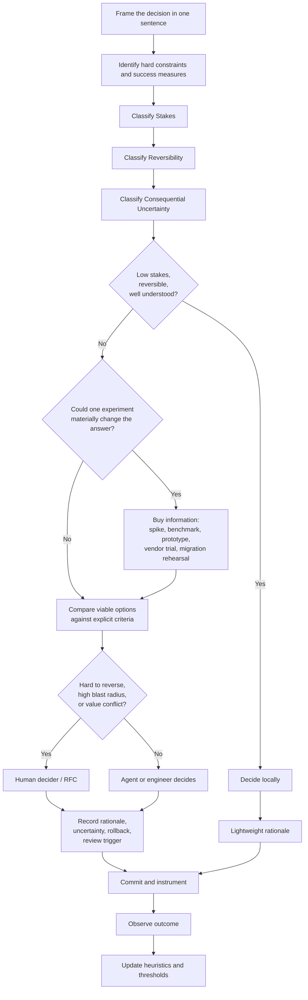
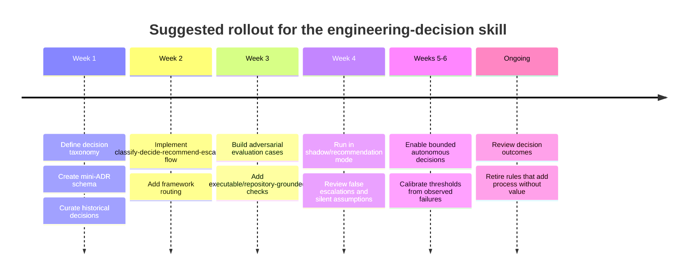

# Elite Engineering Decision-Making and Trade-off Reasoning

## Executive summary

**The answer is judgment, not frameworks — but elite judgment is scaffolded by a small repertoire of frameworks, explicit evidence, and feedback loops.** The transferable skill is best described as **adaptive engineering judgment**: recognizing what kind of decision is being made, identifying the few variables that can actually change the answer, matching the amount of analysis to stakes/reversibility/uncertainty, and knowing when additional analysis is no longer worth its cost.

That conclusion fits both decision-science evidence and experienced engineering practice. In naturalistic studies, experienced fireground commanders usually did **not** enumerate and score alternatives: they recognized situations, generated a plausible action from experience, and mentally tested it. Yet Kahneman and Klein's reconciliation of intuition research warns that this sort of intuition is trustworthy only where the environment has enough regularity to learn and the decision-maker has received meaningful feedback; subjective confidence itself is not evidence of expertise. citeturn20search0turn20search1 In a very different setting, geopolitical forecasting research found that stronger forecasters were distinguished by open-mindedness, probabilistic reasoning, frequent belief updating, deliberation, and enriched collaborative environments — evidence that excellent judgment is trainable and auditable rather than simply "having good instincts." citeturn20search2turn20search11

Experienced engineering organizations express a compatible idea in less academic language. Amazon's documented distinction between hard-to-reverse "one-way-door" and reversible "two-way-door" decisions is fundamentally a rule about **matching process cost to reversibility**: reversible decisions should generally be made quickly and locally, while consequential irreversible decisions deserve more care. Amazon's 2016 shareholder letter also used roughly 70% of desired information as a practitioner heuristic for many decisions rather than waiting for near-certainty. This is influential operating practice, not controlled evidence, and should be treated accordingly. citeturn1search4turn1search6

The attached brief correctly questions whether "decision frameworks" is the right abstraction. Its requested domains — architecture, vendors, rewrites, technical debt, platforms, standardization, and agent autonomy — do not share one optimal algorithm. fileciteturn0file0 Instead, the common structure is:

> **Classify the decision → make the trade-off explicit → buy only decision-changing information → preserve optionality where uncertainty is high → assign a decider → commit → observe → update your future judgment.**

The most useful frameworks are therefore **specialized instruments**, not a stack of rituals. Expected-value reasoning is useful for quantified uncertainty; ATAM for architecture quality-attribute interactions; prospective hindsight/pre-mortems for surfacing failure paths; RFCs/ADRs for making consequential reasoning durable; real-options thinking for uncertainty plus irreversibility; and RAPID/DACI-like role models when the bottleneck is unclear authority. Cynefin, Wardley Mapping, WSJF, and one-way/two-way doors can all be useful, but their popularity substantially exceeds the strength of direct evidence that applying the branded framework causes better engineering outcomes. citeturn0search10turn2search0turn10view0turn3search0turn8view0turn0search1turn5search0turn4search1

For LLM coding agents, this implies **bounded autonomy rather than either full autonomy or approval on every action**. Agents should autonomously make low-stakes, reversible, testable choices; recommend a choice when values or cross-component trade-offs matter; and escalate hard-to-reverse, high-blast-radius, security/data/contractual, or genuinely underspecified decisions. Research finds that coding agents have difficulty distinguishing sufficiently specified from underspecified tasks, while interactive clarification can materially help. Other work has found provider preferences in code-generation choices, and research on self-correction shows that asking a model to reconsider itself without new external evidence is not a dependable substitute for validation. citeturn18academia31turn11search3turn13search4 Anthropic's own current agent-engineering practice emphasizes executable outcome graders, traces, explicit success criteria, and evaluations for behaviours including over-engineering. citeturn18search0

The compact playbook recommended in this report is therefore:

| Decision profile | Default behaviour | Analysis budget | Durable record |
|---|---|---:|---|
| Low stakes + reversible + well understood | **Decide** | Minutes | Commit/PR rationale |
| Material but reversible, or moderate uncertainty | **Decide or recommend** | Tens of minutes to a few hours | Mini-ADR |
| High stakes, cross-boundary, costly to reverse | **Recommend; human decides** | Hours to a few working days | ADR/RFC + evidence |
| Irreversible/high blast radius + high uncertainty | **Escalate and buy information first** | Explicit decision deadline; staged experiment where possible | Full decision record + review trigger |

These time ranges are **recommended operating defaults, not empirically established universal constants**. No credible evidence supports a single "right" number of hours for engineering decisions. The useful principle is proportionality: analysis should grow with **stakes × irreversibility × consequential uncertainty**, and shrink as the cost of delay rises.

## Research plan and methodology

The attached prompt was treated as the authoritative research brief. It asks for evidence on the nature of elite judgment, engineering decision frameworks, transferable trade-off reasoning, recurring CTO-level decisions, decision control flow, failure modes, and LLM agents as engineering decision-makers; it explicitly excludes unrelated business strategy and most people-management questions. fileciteturn0file0

**Research method.** Sources were assessed in roughly the following order of evidentiary weight:

| Evidence tier | What was prioritized | How it is used here |
|---|---|---|
| Formal / experimental | Original decision-science papers, formal distributed-systems results, controlled or tournament evidence | Supports general principles where transfer is defensible |
| Empirical software engineering | Original industrial studies, case studies, field research | Supports engineering-specific claims |
| Documented operating practice | Official company engineering material, RFC processes, architecture methods | Supports how strong organizations actually work |
| Practitioner framework | Framework creator's own material, consultancy/team-playbook documentation | Describes a useful tool, **not** proof that it improves outcomes |
| Secondary/popular exposition | Avoided where a primary source was available | Not used as evidentiary foundation |

Primary sources include Kahneman and Klein on intuitive expertise, Klein and colleagues on recognition-primed decisions, Mellers/Tetlock and collaborators on forecasting calibration, Parnas on modular decomposition, Gilbert and Lynch on CAP, the CMU Software Engineering Institute on ATAM/CBAM, original technical-debt studies, official Rust and IETF decision processes, and current Anthropic/Google engineering research. citeturn20search1turn20search0turn20search11turn16search3turn17search0turn0search10turn15search0turn9search2turn9search9turn18search0turn22search12

The review deliberately separates **three different claims that are often conflated**:

1. a framework has a sound theoretical mechanism;
2. practitioners find it useful;
3. controlled evidence shows that applying it improves outcomes.

For many famous engineering frameworks, evidence exists mainly for the first or second claim, not the third. Wardley himself explicitly cautions against treating maps as deterministic prescriptions, while the original Cynefin publication positions it as a sense-making framework rather than a universal optimizing algorithm. citeturn5search0turn5search14turn0search1

There are also limits to cross-domain inference. Fireground command is not software architecture, and geopolitical forecasting is not vendor selection. Those studies are used to identify plausible general properties of expertise — feedback, pattern recognition, calibration, updating — rather than to claim that software leaders literally decide like firefighters or forecasters. citeturn20search0turn20search11

The analysis is current to **October 2, 2026**. Canadian sources were to be prioritized if relevant, but the brief contains no Canadian legal, regulatory, procurement, privacy, or public-sector constraint; introducing one would be an unsupported assumption. Likewise, no organization size, budget, availability target, regulated-data class, cloud provider, team topology, or risk tolerance is specified. Those dimensions are therefore treated as variables rather than silently filled in.

## Key research questions and assumptions

The research questions below are extracted directly from the attached brief rather than substituted with a different agenda. fileciteturn0file0

| Research question | Operational interpretation |
|---|---|
| **What is the underlying skill?** | Determine whether superior engineering decisions arise mainly from frameworks, heuristics, formal analysis, intuition, calibration, or the ability to switch among them. |
| **Which frameworks survive scrutiny?** | For each named method, identify the question it answers, appropriate context, failure mode, application cost, and evidence level. |
| **What trade-off reasoning transfers?** | Separate general methods such as option value and lifecycle cost from domain-specific constraints such as CAP. |
| **How should recurring engineering choices be made?** | Synthesize good practice for vendors, architecture decomposition, rewrites, build/buy, technical debt, platforms, standardization, and staged investment. |
| **What should the control flow be?** | Establish a path from framing through evidence, decision, commitment, validation, and review, with proportional process. |
| **What repeatedly corrupts judgment?** | Identify behavioural and organizational signals for sunk cost, résumé-driven development, novelty, authority bias, over-analysis, premature optimization, and cargo culting. |
| **What changes when the decision-maker is an agent?** | Determine when an agent should act autonomously, make a recommendation, or require a human decision, and what evidence/record it must leave. |

**Assumptions deliberately *not* made.** The brief does not specify company stage or scale; whether the system is consumer, enterprise, embedded, financial, health, gaming, or safety-critical; existing architecture; contractual or compliance requirements; budget; reliability objectives; allowable downtime; migration windows; vendor policy; or how much authority the proposed Claude Code skill will receive. fileciteturn0file0 Consequently, this report recommends a **decision kernel with configurable thresholds**, not universal answers such as "always choose a monolith" or "always buy commodity software."

One positive assumption *is* warranted by the brief: the intended user is already a senior engineer with strong product/design context, and the skill is intended to assist both that engineer and coding agents with higher-quality engineering choices. fileciteturn0file0 The playbook therefore emphasizes concise reasoning and escalation rather than educational checklists for beginners.

## Findings: judgment, frameworks, and the decision playbook

**What elite judgment appears to consist of.** The evidence points to a mixture, but the ordering matters. Experts do not normally begin by asking "which framework should I use?" They recognize salient features, retrieve patterns from experience, and spend explicit analysis on ambiguity, novel conditions, competing objectives, or consequences that make a wrong intuitive match expensive. In Klein's fireground study, experienced commanders showed simultaneous comparison of multiple alternatives at fewer than 12% of probed decision points; recognition of a situation and an associated action dominated. citeturn20search0 But Kahneman and Klein jointly argue that intuitive confidence is justified only where the environment is sufficiently predictable and experience provides opportunities to learn its regularities. citeturn20search1

That gives a useful engineering distinction:

**Experience is a cache, not an oracle.** Repeated decisions such as library upgrades, component boundaries, rollout mechanisms, testing strategies, and common failure recovery can often legitimately use pattern recognition. Novel distributed consistency models, seven-figure vendor commitments, irreversible data migrations, unfamiliar security boundaries, or a rewrite of a critical platform are much less suitable for unexamined intuition because the decision-maker may lack representative feedback.

The forecasting literature adds a second component: **calibration and updating**. In a tournament involving more than 150,000 forecasts by 743 participants across 199 events, better performance was associated with cognitive flexibility/open-mindedness, probabilistic training, collaboration, greater deliberation, and more frequent belief updating. citeturn20search11 Superior decision-making is therefore better modelled as an ongoing learning system than as a collection of clever mental models.

### The compact decision kernel

The following is a synthesis of those findings with documented engineering practice. Exact thresholds are intentionally configurable.



The crucial third axis is **consequential uncertainty**, not uncertainty in the abstract. A team may know little about an easily discarded prototype and rationally proceed. Conversely, even modest uncertainty matters if a choice locks years of data, contracts, or public interfaces into place. Real-options reasoning formalizes why preserving the right — but not the obligation — to make a future choice can be valuable when uncertainty remains high. CMU SEI work has explicitly applied real-options reasoning to architectural design. citeturn3search0

### How much process each class deserves

These are **house defaults proposed from the evidence**, not scientifically validated time limits.

| Class | Typical profile | Who decides | Minimum analysis | Suggested time-box | Record |
|---|---|---|---|---:|---|
| **Local** | Low stakes, highly reversible, familiar, good automated feedback | Agent or engineer | Check constraints; choose simple viable option | ~5–30 min | PR/commit sentence |
| **Material** | Moderate impact or uncertainty, still inexpensive to undo | Engineer/agent, possibly async reviewer | Status quo + plausible alternative; criteria; test unknown most likely to change answer | ~30 min–2 h | Mini-ADR |
| **Architectural** | Cross-component/team effects, migration cost, difficult rollback, meaningful run cost | Named human decider after recommendations | 2–3 viable alternatives; evidence; quality attributes; migration/rollback; dissent | ~1–3 working days | ADR or RFC |
| **Strategic/one-way** | Large blast radius, long lock-in, major data/security/contract consequences, high uncertainty | Explicit accountable human/group governance | Experiments where possible; sensitivity analysis; pre-mortem; independent challenge; staged commitment | Explicit deadline, often days–weeks | Full RFC/decision record + review date |

Amazon's one-way/two-way-door distinction strongly supports the *direction* of this proportionality principle, but neither its terminology nor its 70%-information heuristic should be treated as empirically optimized constants. citeturn1search4turn1search6

**The stopping rule is more important than the clock.** Stop when one of four conditions is met: the option is robust across plausible uncertainty ranges; a hard constraint dominates the choice; the next piece of information is unlikely to change the ranking enough to justify its delay; or the precommitted decision deadline arrives. For high-uncertainty one-way doors, do not simply analyse longer — try to **convert the one-way door into a two-way door** through a pilot, compatibility layer, parallel run, export clause, feature flag, canary, or incremental migration.

### Frameworks worth knowing

"Cost" below means typical cognitive/process overhead, not licensing expense. Evidence ratings judge support for the *decision method*, not whether its underlying concepts exist.

| Framework / method | Question it actually answers | Best fit | Common misuse | Application cost | Evidence assessment |
|---|---|---|---|---|---|
| **Reversibility / one-way vs two-way doors** | "How expensive will being wrong be, and therefore how much process is justified?" | Almost every engineering choice | Treating technically reversible choices as cheaply reversible despite data migration, customer, political, or contract costs | **Very low** | Excellent heuristic; documented Amazon practice, but little causal validation as a branded framework. citeturn1search4turn1search6 |
| **Expected value / probabilistic decision analysis** | "Given uncertain outcomes, which option has the best probability-weighted consequence?" | Bets with estimable ranges: capacity, migrations, reliability investment, vendor economics | Inventing precise probabilities/utilities and disguising guesses as mathematics | **Low–medium** | Strong normative foundation; effectiveness depends on input quality. Forecasting evidence supports explicit probabilities, calibration and updating. citeturn20search11turn20search12 |
| **Satisficing / bounded rationality** | "What option is good enough given limited information and decision cost?" | Large option spaces; reversible commodity choices | Setting an arbitrary bar that ignores catastrophic tail risks | **Very low** | Foundational decision theory/descriptive work originating with Simon; better viewed as a principle than a recipe. citeturn2search3 |
| **Pre-mortem / prospective hindsight** | "Assume this failed — what likely caused it?" | Migrations, launches, architecture changes, large vendor/platform bets | Producing generic risk lists without owners, mitigations, or decision changes | **Low** | Prospective hindsight has experimental support; software-specific pre-mortem effectiveness is less firmly established. citeturn2search0 |
| **ATAM / quality-attribute trade-off analysis** | "Where does an architecture satisfy or conflict across performance, modifiability, security, availability, etc.?" | Consequential architecture with multiple quality attributes/stakeholders | Running heavyweight workshops for ordinary component choices; discussing vague "-ilities" without scenarios | **Medium–high** | One of the better-grounded software-specific methods; SEI developed ATAM and reported results across real evaluations. citeturn0search10turn0search0 |
| **Real options** | "What is the value of delaying commitment or paying to retain a future choice?" | High uncertainty + irreversible commitments: architecture boundaries, vendor/data portability, staged migration | Calling all procrastination "optionality"; forgetting the carrying cost of keeping options open | **Medium** | Strong economic theory; useful SEI architectural applications, but much less directly validated than its popularity sometimes suggests. citeturn3search0turn3search10 |
| **Cost of Delay / WSJF** | "What should go first when delay itself has economic cost?" | Portfolio/sequencing decisions with constrained capacity | Treating guessed Fibonacci-like scores as objective economics; allowing score arithmetic to replace strategy | **Low–medium** | Cost-of-delay reasoning is economically coherent; SAFe's particular WSJF proxy is primarily a practitioner method rather than strongly validated causal science. citeturn4search1 |
| **Cynefin** | "What kind of causal environment are we in, and therefore what style of action/learning makes sense?" | Novel/complex incidents, sense-making, avoiding inappropriate certainty | Labeling every difficult problem "complex"; using quadrant classification as an answer generator | **Low–medium** | Original work is grounded in action research and explicitly positioned as sense-making; limited evidence of superior outcomes versus alternatives. citeturn0search1 |
| **Wardley Mapping** | "Where are user needs, dependencies, and components on an evolution/maturity landscape?" | Strategic technology landscape and build/adopt conversations | Treating subjective map positions as measurements or the map as a strategy oracle | **Medium** | Useful practitioner technique; Wardley himself cautions that maps do not guarantee outcomes. Evidence remains largely practitioner-based. citeturn5search0turn5search14 |
| **Build / buy / adopt** | "Where should we own differentiation and control versus consume an existing capability?" | Vendors, SaaS, open source, infrastructure/platform choices | "Build core, buy commodity" without quantifying integration, run cost, exit cost, security, and strategic constraints | **Medium–high** because evidence gathering dominates | No single validated universal framework. Best treated as a synthesis of lifecycle cost, option value, strategic differentiation and lock-in. |
| **ADR / RFC** | "How do we expose reasoning, invite the right review, commit, and preserve why?" | Decisions whose rationale matters after the current conversation | Turning every minor choice into bureaucracy; ADRs that record only the final answer | **Low–high**, proportional to scope | Strongly useful as traceability/process infrastructure, but limited causal research showing that ADR/RFC adoption alone improves architecture. Nygard's original ADR format is intentionally short; Rust reserves RFCs for substantial changes. citeturn10view0turn9search2 |
| **RAPID / DACI** | "Who gathers input, who decides, and who only needs informing?" | Multi-stakeholder decisions stalled by ambiguous authority | Treating role assignment as decision quality; appointing multiple effective final deciders | **Low** | Plausible mechanism and extensive practitioner use; RAPID evidence is largely Bain's proprietary experience/survey work, while DACI is Atlassian practice rather than strong independent causal evidence. citeturn8view0turn21search0 |
| **Rough consensus + running evidence** | "How do we commit without demanding unanimity while still taking objections seriously?" | Standards/RFC-like technical decisions | Equating consensus with voting or suppressing technically substantive dissent | **Medium** | Mature documented engineering-governance practice at the IETF; evidence of fitness is institutional/practitioner rather than randomized. citeturn9search9 |

The practical implication is not to memorize thirteen methods. A strong engineer needs perhaps **five default moves**: assess reversibility; identify constraints and quality attributes; express consequential uncertainty; run the cheapest discriminating experiment; and leave a proportionate decision record. The other frameworks are tools to reach for when a specific problem warrants them.

## Analysis: trade-offs, recurring decisions, and failure modes

### Transferable trade-off heuristics

Some engineering trade-offs are domain-specific: CAP, for example, describes a formal impossibility under its model, not a generic metaphor for "you can only have two things." Gilbert and Lynch formalized that atomic consistency and the defined form of availability cannot both be guaranteed through arbitrary network partitions; later discussion emphasizes that this is specifically a partition-time constraint. citeturn17search0 But several higher-level reasoning patterns transfer well across domains.

| Transferable heuristic | How to reason | Concrete engineering example |
|---|---|---|
| **Preserve option value while uncertainty is high** | Prefer choices that reveal information without locking in the final architecture. Pay for optionality only when future flexibility is plausibly valuable. | Trial a vendor behind an internal interface with tested export before coupling domain objects directly to proprietary APIs. Real-options architecture work gives this principle formal grounding. citeturn3search0 |
| **Make the easy-to-reverse decision quickly** | Decision effort should scale with reversal cost, not how intellectually interesting the problem is. | Trying a local state-management abstraction is cheap; changing a public API or canonical data model is not. Amazon's two-way-door practice is a useful operating heuristic here. citeturn1search4 |
| **Pay complexity rent only for a demonstrated constraint** | Every abstraction/distribution layer has acquisition *and recurring* cognitive/operational cost. Demand a concrete problem that earns that cost. | Do not create five services merely because independent deployment might someday matter. Fowler notes distribution adds remote-failure, latency, consistency and refactoring complexity; Google's Istio team published a case of moving in the opposite direction, from microservices toward a monolithic architecture. citeturn16search2turn16search5 |
| **Hide what is likely to change** | Put boundaries around volatile design decisions rather than arbitrary processing stages. | Encapsulate payment-provider semantics behind a stable domain boundary rather than letting vendor SDK types propagate everywhere. Parnas's classic modularity work argues that decomposition quality depends on what design information modules hide. citeturn16search3 |
| **Translate "-ilities" into scenarios** | "Fast", "reliable", and "flexible" cannot be traded off until attached to workload, stimulus and measurable response. | Replace "must scale" with "checkout sustains X load with p99 < Y and no more than Z recovery time." ATAM is specifically structured around exposing sensitivities and quality-attribute trade-offs. citeturn0search10 |
| **Optimize lifecycle cost, not build cost** | Count migration, learning, integration, operations, incidents, upgrades, support, exit and foregone product work. | A free open-source database can cost more than managed service fees if it creates persistent operational burden; conversely, a proprietary service may create expensive exit constraints. |
| **Treat technical debt by its interest rate, not its age** | Prioritize debt that repeatedly taxes high-frequency change, spreads, causes reliability/security risk, or blocks an important path. | Refactor a tangled authorization boundary touched weekly before polishing an isolated legacy parser nobody changes. Multi-company research found architectural debt can be "contagious" and produce compounding effort; Google research also found perceived code quality and technical debt linked to developer productivity. citeturn15search0turn22search15 |
| **Prefer a discriminating experiment to broad analysis** | Ask which unknown could change the decision, then test that unknown directly. | Rather than debating whether a framework can render 100k rows, benchmark the representative interaction on target hardware. |
| **Evaluate global cost, not the local team's optimum** | Include imposed dependencies, duplicated expertise, support load, security surface and future coordination. | Letting every team choose an auth framework maximizes local freedom while potentially externalizing patching and incident cost; a platform "golden path" can make standardized choices self-service. Google's current platform guidance explicitly frames platforms as products for internal developers, not mandatory infrastructure for its own sake. citeturn22search0 |
| **Stop when the ranking is robust** | Test whether plausible changes in assumptions reverse the choice. If not, more decimal places add little. | If vendor A still dominates after doubling its estimated migration cost and halving a projected benefit, another week perfecting the spreadsheet is unlikely to be decision-changing. |

This yields a more precise treatment of familiar pairs:

**Speed versus quality** is rarely a binary. Distinguish quality that protects cheap iteration — tests, observability, rollback, coherent boundaries — from polish that can safely wait. Deliberately incurring debt can be rational; what matters is whether the debt creates significant ongoing "interest" or irreversible risk. Industrial technical-debt research shows that different architectural debts impose very different downstream costs. citeturn15search0turn15search3

**Flexibility versus simplicity** should be resolved by asking whether the flexibility protects against a **credible source of change**. Speculative abstractions create certain complexity today in exchange for uncertain future value. Parnas's information-hiding criterion provides a better foundation than generic "make it extensible" advice: modularize around design decisions expected to vary or that other parts of the system should not depend upon. citeturn16search3

**Consistency versus availability** requires domain semantics, not slogans. Under the CAP model, the unavoidable choice arises under network partition and specific definitions of consistency and availability. A payment ledger and a "users online now" indicator can rationally choose differently. citeturn17search0

### Recurring CTO/principal-engineer decisions

| Recurring decision | Good default | Evidence-sensitive exceptions / questions |
|---|---|---|
| **Technology or vendor selection** | Start with requirements and incumbent/status quo. Compare only serious candidates on must-haves, total lifecycle cost, operability, skill fit, security/compliance, ecosystem health, exit/migration cost and reversibility. Run a proof on the highest-risk unknown. | A strategically differentiating capability, strict data residency/security, unusual scale, or poor market options can justify building. Avoid choosing on popularity alone. |
| **Monolith vs services** | **Prefer the least distributed architecture that satisfies real requirements**; a modular monolith is a strong starting option when independent scaling/deployment/failure isolation are not yet valuable enough to pay distributed-systems costs. | Services become compelling when boundaries are understood and independent lifecycle, scale, isolation or ownership materially matters. Fowler explicitly describes distribution as a complexity booster, and the Istio experience shows microservices are not a one-way maturity ladder. citeturn16search0turn16search2turn16search5 |
| **Rewrite vs refactor/migrate** | Default to incremental replacement where a sequence of independently valuable slices exists. | Full rewrite becomes more defensible when incremental coexistence itself is prohibitively complex, the underlying model is fundamentally incompatible with required behaviour, and parity/migration can be tightly bounded. Fowler's Strangler Fig material was motivated by the recurring risk of large critical-system rewrites. citeturn15search12turn15search13 |
| **Build vs buy vs adopt** | Buy/adopt where requirements are commodity-like and switching/operational risk is acceptable; build where control or differentiation produces enough value to exceed lifetime cost. Preserve an exit path in high-uncertainty vendor decisions. | Do not mistake license price for TCO or open source for zero operational cost. Strategic dependence, data gravity and proprietary integration can make an initially reversible purchase progressively less reversible. |
| **When to pay technical debt** | Pay when observed interest — slowed changes, defects, toil, dependency blockage, risk — exceeds the opportunity cost of remediation. | Do not use "20% for debt" or age as universal proxies. Some debt can rationally remain indefinitely; contagious architectural debt warrants earlier action. citeturn15search0turn15academia50 |
| **Platform investment** | Invest after repeated demand is visible across teams; treat the platform as a product, begin with a small useful paved/golden path, make adoption self-service, and measure whether it removes actual friction. | Do not build an elaborate internal platform in anticipation of hypothetical scale. Google's platform guidance emphasizes developer-as-customer, self-service, feedback and iteration; DORA's research treats platform engineering as a contextual capability rather than a magic tool installation. citeturn22search0turn22search12 |
| **Standardization vs team autonomy** | Standardize choices with large externalities: identity/security controls, service interfaces, observability expectations, deployment/recovery fundamentals, shared data contracts. Leave reversible local implementation details decentralized. | An escape hatch should exist where a team can demonstrate that the standard fails an important constraint. This preserves learning while preventing local choices from silently imposing global costs. |
| **Staffing an engineering bet** | Treat additional capacity as staged investment: fund the smallest credible team necessary to retire the key uncertainty, then increase commitment when evidence improves. | Adding people cannot repair an undefined problem or unresolved architecture. This is a **real-options-based inference**, not a universal empirical staffing law. citeturn3search0 |

### Failure modes, detection signals and antidotes

| Failure mode | Detection signal | Antidote |
|---|---|---|
| **Résumé-driven development** | Technology appears in the proposed solution before the constraint it solves; "we should use X" is partly justified by career attractiveness or trend status. | Require an incumbent/status-quo option, explicit decision criteria, operational/migration cost and a falsifiable reason the new technology wins. Empirical research surveying hundreds of software professionals found labour-market and technology-trend incentives consistent with the phenomenon, so it should not be dismissed as merely a joke. citeturn14academia46 |
| **Sunk-cost escalation** | Past investment is offered as a reason to continue independent of future benefit: "we've already spent six months." | Reframe: "Starting from today's state, which path has the best prospective cost/benefit?" Arkes and Blumer's classic experiments found prior investment can increase willingness to continue an endeavour. citeturn14search0 |
| **Analysis paralysis** | New research no longer changes criteria or rankings; new criteria are added whenever a favourite option loses; no decision date exists. | Precommit a deadline and the key evidence needed; use reversibility to lower the burden; ask whether the next information has enough value to delay action. |
| **HiPPO / authority substitution** | Seniority closes a technical question before evidence/objections are surfaced. | Separate **input** from **decision right**. A single accountable decider can still solicit expert input and document dissent. RAPID/DACI are useful for role clarity, but should not be mistaken for evidence that the highest-status person's technical view is correct. citeturn8view0turn21search0 |
| **Novelty bias** | "Modern", "cloud native", "AI-native", "microservices", etc. functions as a benefit without a measurable requirement. | Make the current solution the baseline; enumerate the new recurring complexity; require a demonstrated constraint or option value that pays for it. The Istio monolith migration is an instructive reminder that architectural fashions are not maturity levels. citeturn16search5 |
| **Premature optimization** | Work is optimizing a presumed bottleneck without representative measurements or an explicit target. | Instrument first, identify the actual bottleneck, then optimize against a measurable objective. Preserve the simpler design if both meet the requirement. |
| **Cargo-culting big tech** | "Company X does this" is the central argument although your traffic, organization, failure model or compliance constraints differ. | Ask: **Which constraint that forced X's solution do we also have?** If that question has no concrete answer, retain the simpler option. Fowler explicitly warns that distributed architecture adds complexity even when its benefits are real. citeturn16search2 |
| **Local optimum / externalized complexity** | One team's "simplification" creates a new service, dependency, operational duty, data copy or exception other teams must support. | Put cross-team operating and migration cost in the decision criteria; give affected operators/platform/security teams contributor status for material changes. |
| **Framework cargo cult** | A decision is forced into a familiar 2×2, scorecard or workshop regardless of what uncertainty actually matters. | Begin with the question. Use a framework only when its mechanism matches the bottleneck. Cynefin's original framing as a sense-making device and Wardley's cautions against deterministic map-reading are useful reminders. citeturn0search1turn5search14 |
| **Outcome bias in reviews** | A lucky decision is praised as sound or a sensible decision is condemned solely because an unlikely bad outcome occurred. | Review the contemporaneous information, probability estimate and process separately from the realized outcome; preserve forecasts/assumptions so calibration can improve over repeated decisions. Forecasting research demonstrates the value of scored predictions and updating rather than retrospective certainty. citeturn20search11turn20search12 |

The meta-antidote across this catalogue is **make the reason falsifiable before the outcome is known**. "Microservices will let the checkout and catalogue teams deploy independently, and independent-release lead time is the constraint we are addressing" can later be checked. "Microservices are best practice" cannot.

## Agent-specific decision governance

LLM agents make the need for explicit decision governance more acute because they combine enormous breadth with weak guarantees about calibration, implicit assumptions and when to stop.

Three empirical findings are especially relevant.

First, **underspecification is not reliably detected**. In interactive software-engineering experiments, models struggled to distinguish sufficiently specified from underspecified instructions, while interaction on genuinely underspecified tasks improved results by eliciting missing information. citeturn18academia31 This argues for an escalation rule based not on "am I uncertain?" but on the more objective question: **could reasonable answers to the missing information change the engineering choice?**

Second, an agent can import latent preferences that are unrelated to your criteria. A 2025 ACL study of code generation found significant provider preferences across tested LLMs, including cases where models changed inputs toward preferred cloud providers. citeturn11search3 The defence is not "tell the agent to be unbiased"; it is to require the incumbent option, explicit criteria, alternatives, and evidence tied to those criteria.

Third, **reflection is not validation**. Research on intrinsic LLM self-correction found that models can fail to improve, or even degrade, when asked to self-correct without external feedback. citeturn13search4 Coding-agent research and current production practice instead point toward executable tests, tool feedback, static checks, environmental state and other independent validators. SWE-agent was explicitly designed around a computer interface that lets the agent inspect and test repository changes, while Anthropic's current agent evaluation guidance distinguishes an agent's verbal claim from the actual final state in its environment. citeturn13search0turn18search0

### Decide, recommend, or escalate

| Agent mode | Conditions | Agent behaviour |
|---|---|---|
| **DECIDE** | Low/moderate stakes; cheaply reversible; intent clear; change local; existing conventions answer much of the question; automated validation is strong | Choose the simplest satisfactory option, implement, validate, leave a short rationale |
| **RECOMMEND** | Multiple legitimate value trade-offs; cross-component effect; meaningful migration/run cost; uncertain evidence; architecture boundary changes | Surface 2–3 serious options including status quo where viable; state criteria and unknowns; recommend one; identify what would change the recommendation |
| **ESCALATE** | Hard-to-reverse/high-blast-radius decision; irreversible data operation; material security/privacy boundary; contractual/vendor lock-in; public compatibility commitment; missing product requirement that changes architecture; destructive action; disagreement over values rather than facts | Stop before commitment, summarize known facts, ask the **smallest decision-changing question**, and identify a safe reversible next step where possible |

A useful governance rule is:

> **The agent may decide when it can cheaply detect and undo being wrong. It should recommend when being wrong is detectable but expensive. It should escalate when correctness depends on human intent/values or the consequences cannot be cheaply contained.**

This avoids the opposite failure: prompting a human on every trivial action. Anthropic reported in 2026 that users approved roughly 93% of Claude Code permission prompts in its telemetry and that repeated approvals reduced diligence, motivating greater use of containment and automated handling of safer operations. citeturn18search10 Human attention is itself a scarce control surface; escalation should be selective enough that it means something.

### Minimum decision record

For a reusable coding-agent skill, the following is sufficient for most nontrivial decisions:

```yaml
decision: "What are we choosing?"
class: local | material | architectural | strategic

stakes: low | medium | high
reversibility: easy | costly | hard
uncertainty: low | medium | high

constraints:
  - "Hard requirements only"

options:
  - name: "status quo / option A"
    key_tradeoff: "..."
  - name: "option B"
    key_tradeoff: "..."

choice: "..."
why: "The 1-3 factors that actually decided it"

evidence:
  - "benchmark / repo evidence / docs / experiment / prior ADR"

unknowns:
  - "What remains uncertain"

rollback: "How this is undone, or 'not cheaply reversible'"
validation: "Tests / metrics / observation that will reveal whether it worked"
escalate_if: "Condition requiring human decision"
review_trigger: "Date, scale threshold, incident, or changed assumption"
```

Nygard's original ADR proposal likewise emphasizes a compact record of context, decision, status and consequences rather than large design documents; superseded records remain useful because the historical reasoning stays visible. citeturn10view0 Rust's RFC process similarly reserves heavier process for substantial changes and asks authors to cover motivation, drawbacks and alternatives instead of applying it to every fix. citeturn9search2

For **local** decisions, most of that schema can collapse into two sentences in the PR. The record should scale with the decision, not become mandatory paperwork.

### A decision routine suitable for a Claude Code skill

The skill should implement this control flow rather than a giant catalogue of frameworks:

1. **Frame** one decision at a time and separate hard constraints from preferences.
2. **Classify** stakes, reversibility and consequential uncertainty.
3. **Check specification sufficiency**: identify only missing information that could actually flip the choice.
4. For Material+ decisions, include the **status quo and at least one credible alternative**.
5. Identify the **two or three criteria most likely to decide the result**; avoid exhaustive generic lists.
6. Gather the cheapest **external evidence** that distinguishes the options: repository evidence, documentation, benchmark, tests, prototype, dependency graph, pricing, migration rehearsal.
7. Prefer the choice that satisfies constraints with the **lowest unnecessary complexity**, while preserving valuable optionality.
8. **Decide, recommend, or escalate** using the table above.
9. Validate through tools and outcomes rather than relying on self-critique.
10. Leave the proportionate record and a review trigger.

Anthropic's current work is notably compatible with this design: it reports that Claude Code itself added evaluations for behaviours such as over-engineering; its long-running-agent work stresses decomposition, structured hand-offs, and criteria-based evaluator agents; and its tooling guidance recommends testing agents against explicit evaluations rather than assuming tool descriptions will produce desired behaviour. citeturn18search0turn19search1turn19search4

An "adversarial reviewer" can therefore be useful, but it should not just be the same model saying "critique yourself." Give the reviewer a different role and, wherever possible, **different evidence**: tests, production constraints, architecture rules, performance data, security policy, or customer requirements. The independent evidence is more important than the number of agents. This is also consistent with findings that simpler bounded repair-and-validation pipelines can sometimes rival or outperform more elaborate agent scaffolds on software-engineering benchmarks. citeturn13academia37turn13search4

## Recommendations and implementation roadmap

The central recommendation is to build the reusable skill around a **decision kernel**, not an encyclopaedia of frameworks.

**Recommended operating doctrine:** *Use intuition for familiar, feedback-rich, reversible decisions; use explicit analysis when novelty, conflicting objectives or irreversibility invalidate that intuition; use frameworks only to answer a particular missing question; and continuously calibrate judgment against outcomes.* That formulation follows the boundary conditions on intuitive expertise, evidence from forecasting calibration, the proportional-process logic visible in Amazon's engineering leadership practice, and architecture methods that turn vague quality objectives into inspectable trade-offs. citeturn20search1turn20search11turn1search4turn0search10

The skill should encode six defaults:

| Default | Policy |
|---|---|
| **Reversibility first** | Before deep analysis, ask how cheaply the choice can be undone. Make reversible decisions quickly; engineer reversibility into important uncertain ones. |
| **Status quo is an option** | An agent proposing new infrastructure, abstraction or dependency must compare it with doing nothing/new work inside the existing approach. |
| **Few decisive criteria** | Force identification of the 2–3 criteria that can change the answer rather than producing generic ten-item pro/con lists. |
| **Evidence before elegance** | Prefer repository inspection, measurements, tests, spikes and primary documentation to architectural rhetoric or model confidence. |
| **One decider, open dissent** | For material human decisions, identify who actually owns the decision while making expert objections visible. Role frameworks can support this but are not substitutes for technical judgment. citeturn8view0turn9search9 |
| **Review the decision system** | Preserve enough prediction/rationale to learn whether confidence, assumptions and escalation thresholds are calibrated over time. |

### Proposed implementation roadmap

Because the brief specifies neither deadline nor budget, the figures below are **planning estimates**, not externally established benchmarks. A useful v1 should be small enough that the decision skill does not itself become an over-engineered platform.



| Phase | Deliverable | Indicative engineering effort | Exit criterion |
|---|---|---:|---|
| **Decision corpus** | 20–40 anonymized past engineering decisions labelled by stakes/reversibility/uncertainty and whether the eventual choice was regretted or reversed | ~0.5–1.5 days | Cases span local through one-way-door decisions |
| **Kernel v1** | Skill instructions implementing classification, option generation, stopping rule, decide/recommend/escalate and record schema | ~1–2 days | Same inputs produce sensible process tier without unnecessary ritual |
| **Framework router** | Small rules for when to invoke ATAM-lite, pre-mortem, expected-value ranges, real-options analysis, RFC/ADR or role clarification | ~0.5–1 day | Each framework is tied to a question rather than triggered by keywords |
| **Evaluation suite** | 30–60 scenarios covering over-engineering, fashionable-stack defaults, sunk cost, ambiguous intent, destructive changes, vendor lock-in, architecture trade-offs and needless escalation | ~2–4 days | Behaviour is automatically or rubric-graded where practical |
| **Shadow pilot** | Agent recommends decisions but human remains decider; log overrides, missed constraints and low-value escalations | ~1–2 days of analysis across several weeks of elapsed use | Failure taxonomy stabilizes; thresholds can be changed from evidence |
| **Bounded autonomy** | Automatic execution for Local decisions, recommendation for Material/Architectural decisions, hard escalation gates for Strategic decisions | ~0.5–1 day plus ongoing tuning | Measured false-autonomy and alert-fatigue rates are acceptable |

A realistic **v1 build budget is therefore roughly 5–10 engineer-days**, spread across approximately four to six calendar weeks so that actual decisions can be observed between iterations. That is a proposed scope estimate, not a market quotation. No additional software-spend budget is implied by the brief.

The evaluation suite matters more than making the initial prompt elaborate. Anthropic's 2026 guidance reports that explicit agent evaluations became increasingly important as Claude Code scaled, including evaluation of over-engineering, and recommends grading the actual environmental outcome rather than trusting what the agent says it accomplished. citeturn18search0 The skill should therefore be optimized against examples of **good judgment**, not merely longer reasoning.

Useful operating metrics are decision latency by class, human override rate, false-escalation rate, unanticipated-constraint rate, reversals that were easy versus unexpectedly costly, unnecessary dependency/service introduction, and the percentage of Architectural/Strategic decisions with an explicit validation or review trigger. When the skill expresses probabilistic beliefs, calibration can additionally be scored over time rather than judging confidence impressionistically; forecasting research shows that scored predictions and repeated updating can distinguish systematically better judgment. citeturn20search11turn20search12

The end-state should **not** be an agent that can recite Cynefin, ATAM, Wardley Mapping, WSJF, real options and RAPID on every task. It should be an agent that often says something much simpler:

> *This is low-stakes and reversible; the repository already establishes a convention; the tests will tell us quickly if it is wrong. I will follow the convention and proceed.*

Or, for a genuinely consequential decision:

> *This commits a public data contract and would be expensive to reverse. Two requirements determine the choice, one is still unknown, and a small migration rehearsal can resolve it. I recommend we run that experiment before committing; the final choice belongs to the human decider.*

That distinction — **knowing when five minutes is enough, and knowing when five minutes is reckless** — is the closest evidence-supported description of the engineering judgment the attached brief is seeking. citeturn20search1turn1search4turn0search10