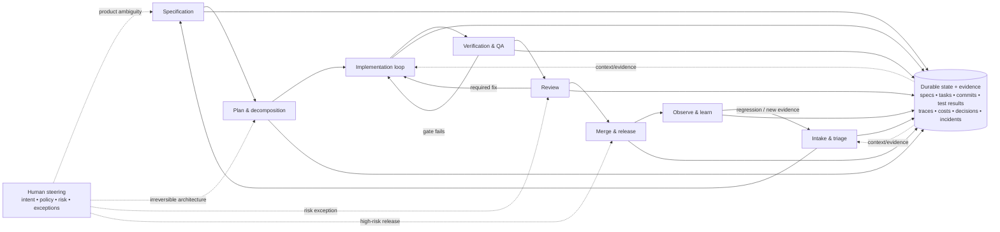
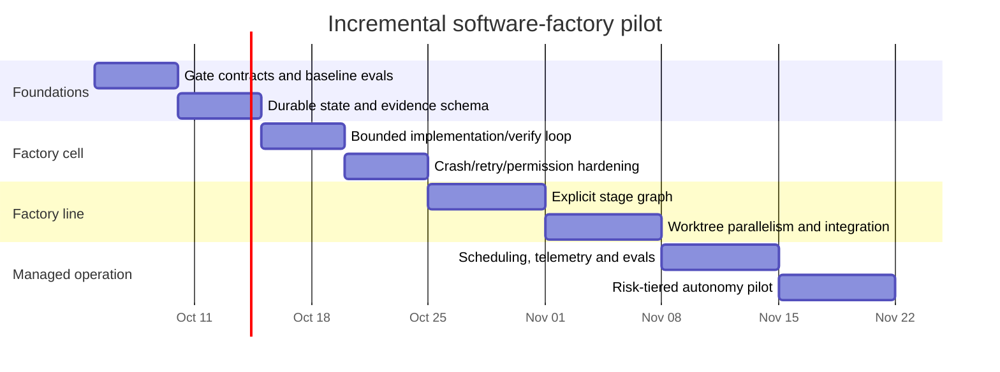

# Software Factories, Loop Engineering, and Graph Engineering: What Is Real in October 2026

## Executive summary

As of **2 October 2026**, the three terms are best understood as **different layers, not synonyms**.

A **software factory** is the whole delivery system: intake, specification, decomposition, implementation, verification, review, merge/release, observability, and feedback, with agents performing an increasing share of execution while humans set intent, policy, risk boundaries, and escalation rules. The term has real historical lineage—Japanese software factories emphasized standardized processes, reusable assets, automation, and quality control; Microsoft’s 2004 “Software Factories” focused on industrializing product-line development with patterns, frameworks, models, and tools. The 2026 agentic version changes the principal worker from a human using automation to an agent operating inside an engineered production system. **[Established | historical–2026]** citeturn2search6turn2search4turn1search1turn18view0

**Loop engineering** is a much newer name for a real control pattern: rather than repeatedly prompting an agent yourself, you engineer a bounded feedback loop that triggers work, observes results, verifies them, revises, and stops or escalates when a machine-checkable condition or budget is reached. IBM called it an “emerging agentic engineering practice” on 17 July 2026; an August 2026 research preprint found functioning autonomous-agent loops in 217 of 256 repositories selected by its heuristics. The pattern is real; the terminology is **emerging rather than standardized**. **[Emerging | June–August 2026]** citeturn15search0turn19view15

**Graph engineering** is substantially less settled. A 30 August 2026 preprint uses the phrase to mean designing long-horizon workflow progression and verification-dependent transitions, distinguishing it from the bounded repair loops inside nodes. That is a useful architecture, but not yet a stable industry term. Worse, “graph” also refers to knowledge/context graphs: Uber’s August 2026 “AI Context Graph,” for example, is a 24-million-node information substrate, not the execution topology of its agents. Design around **typed workflow/state graphs**, not around the phrase “graph engineering.” **[Emerging | August–October 2026]** citeturn19view16turn18view0

The architecture I would recommend for your existing work is therefore:

> **a deterministic outer workflow graph, containing bounded agentic loops, with a conductor allowed to make local decomposition decisions, and hard gates controlling progression.**

That combines the strongest properties of all three ideas. Claude Code’s own current primitives now reflect this distinction: its documentation says a subagent lets Claude decide turn by turn what happens next, whereas a dynamic workflow has a script decide; hooks provide deterministic lifecycle automation; worktrees provide isolation; Routines provide scheduled/API/GitHub-triggered execution; and current releases expose increasingly explicit evaluation and multi-session machinery. **[Established | 2 October 2026]** citeturn19view2turn19view0turn16search5turn16search0turn20view0turn20view1

The evidence also argues strongly against jumping directly to a fully “dark” factory. Uber reported on 27 August 2026 that more than 70% of its pull requests were attributed to local or cloud agents, with more than 3,600 internal skills and more than 30,000 skill executions per day. But Uber still describes human review and escalation, and “attributed to agents” is **not** the same measurement as “merged without human edits.” Meanwhile, the May 2026 RoadmapBench study found that the strongest evaluated model completed only 39.1% of its large, multi-target version-upgrade tasks. Factory-style automation is demonstrably useful; reliable general unattended software development remains unsolved. **[Established first-party production telemetry + emerging independent benchmark evidence | May–August 2026]** citeturn18view0turn19view14

For you specifically, the smallest factory worth building is **not** an autonomous SDLC. It is one **factory cell**:

```text
well-scoped work item
      ↓
immutable acceptance contract
      ↓
isolated agent worktree
      ↕
implement → deterministic verification → repair
      ↓
evidence bundle
      ↓
human merge decision
```

You already possess much of the difficult front half—repository hardening, vague-idea-to-specification, architecture review, and a long-running backlog conductor—according to the attached research specification. Your biggest missing pieces are likely **gate contracts, durable state/receipts, risk classification, isolation conventions, replayable evals, observability/unit economics, and a deliberately conservative merge/release boundary**. fileciteturn0file0

## Objectives, scope, and methodology

The controlling brief is the attached specification; no separate original prompt text was supplied in this turn. I therefore treat the attached document as the authoritative statement of intent. It describes a senior front-end-focused software engineer with strong product/design skills who already has reusable Claude Code skills for repository hardening, specification, architecture review, and conducting a backlog to verified completion, and who wants to understand the complete agentic software-production system rather than another isolated coding-agent technique. fileciteturn0file0

The requested research questions reduce to six architectural questions: whether “software factory,” “loop engineering,” and “graph engineering” have stable meanings; what system boundary each term describes; how a trustworthy factory should be decomposed into stages and gates; whether loops, explicit state graphs, or conductor agents should govern control flow; what production evidence supports autonomous development claims; and what materially changed after the user’s June 2026 research. The brief also requires a mapping onto Claude Code primitives, comparisons with other harnesses, maturity stages, failure modes, and unresolved problems. fileciteturn0file0

**Details that were not specified and therefore affect implementation estimates:**

| Unspecified detail | Working assumption used here | Sensible alternatives |
|---|---|---|
| Target repository | Mature Git repository with usable CI and some automated tests | Greenfield repo; poorly tested brownfield monolith; multi-repo platform |
| Languages/frameworks | Mixed application stack; recommendations stay tool-agnostic | Front-end-heavy TypeScript; backend/service; mobile; infrastructure |
| Team size | One senior engineer initially, expanding to a small pilot group | Solo experiment; 2–3 engineer platform team; organization-wide platform |
| Deadline | No fixed deadline; assume a 4–8 week incremental pilot | 1–2 week factory-cell prototype; 3–6 month production programme |
| Budget | Unspecified; estimate primarily in engineer-weeks | Strict API-spend cap; internal subscription tools; large enterprise budget |
| Existing test quality | Tests exist but are not assumed to be reliable enough to act as a complete oracle | Excellent deterministic CI; sparse tests; heavily flaky integration suite |
| Autonomy target | Human approves merge/release during initial stages | Agent-created PR only; auto-merge low-risk work; fully unattended releases |
| Risk/compliance profile | Ordinary commercial software | Financial/medical/regulatory; security-sensitive; public open source |
| Deployment environment | Existing CI/CD remains authoritative | Local-only; ephemeral cloud sandboxes; self-hosted agent workers |
| Throughput/quality goal | Improve verified throughput without worsening escapes/reverts | Maximize speed; minimize cost; maximize autonomous-merge percentage |
| Model/harness commitment | Claude Code first, architecture portable | Codex-first, LangGraph/custom SDK, mixed-provider fleet |
| Acceptable operating spend | Unknown; begin with hard caps and measure cost per accepted outcome | Low fixed monthly ceiling; cost-per-PR target; unconstrained research budget |

The cost figures later in this report are therefore **planning envelopes, not vendor-price forecasts**. Product-by-product pricing is explicitly out of scope in the attached brief. fileciteturn0file0

**Method.** The evidence hierarchy was: first, the attached specification; second, primary historical research and author/publisher material; third, current official product documentation; fourth, original research papers/preprints; fifth, engineering reports from teams operating agent systems in production. Vendor or company outcome numbers are reported as *first-party telemetry*, not silently converted into independently verified facts. Academic preprints are identified as emerging evidence rather than peer-reviewed consensus.

For terminology, particular weight was given to Cusumano’s research on Japanese software factories, the Greenfield/Short/Cook Microsoft-era material, IBM’s July 2026 definition of loop engineering, the August 2026 empirical loop-engineering preprint, and the August 2026 paper explicitly separating graph, loop, and harness engineering. citeturn2search4turn1search1turn15search0turn19view15turn19view16

For current engineering practice, priority went to Anthropic’s live Claude Code documentation and changelog as of 2 October 2026, OpenAI’s official harness-engineering and Codex material, GitHub’s Spec Kit documentation, LangGraph documentation, and first-party engineering reports from Uber, Dropbox, Spotify, and Meta. citeturn20view3turn19view0turn19view8turn17search0turn13search1turn14search8turn18view0turn18view5turn18view6turn18view7

A useful caution throughout is the distinction between **capability**, **workflow reliability**, and **production outcome**. A model completing a benchmark task, an agent producing a PR, a PR being merged, and a deployed change remaining correct are four different events. RoadmapBench’s long-horizon results and the production teams’ continued emphasis on verification make that distinction material rather than semantic. **[Established/emerging | May–October 2026]** citeturn19view14turn18view0turn18view5

## Definitions and lineage

The cleanest way to resolve the vocabulary is to separate **system boundary** from **control primitive**.

| Concept | Problem addressed | Unit of design | Typical shape | Includes | Stability as of 2 Oct 2026 | Assessment |
|---|---|---|---|---|---|---|
| **Software factory** | How work moves repeatedly from intent to trustworthy shipped software | Entire socio-technical delivery system | Pipeline/network of specialised stages, gates, storage and feedback | Loops, graphs, agents, tools, humans, CI, observability, policy | High as an architectural metaphor; no universal agentic standard | **Established concept, new agentic implementation** citeturn2search4turn18view0 |
| **Loop engineering** | How an agent keeps making progress without a human manually prompting every iteration | One bounded feedback process | trigger → act → observe → verify → revise → stop/escalate | Prompt/context/harness, verifier, state, budgets | Medium; coherent practitioner meaning since June 2026, now appearing in research | **Emerging but useful** citeturn15search0turn19view15 |
| **Graph engineering** | How multiple stages/loops branch, join, retry and transition over long workflows | Execution topology and state transitions | DAG/state machine/cyclic state graph | Nodes, typed edges, guards, checkpoints, approvals | Low as a term; high as an underlying workflow technique | **Technique established; label unstable** citeturn14search8turn19view16 |

**Software factory lineage.** Cusumano’s historical work describes Hitachi establishing a software facility in 1969 that was explicitly labelled and managed as a factory, followed by Japanese efforts in the 1970s and 1980s to standardize processes, improve quality, automate recurring work and promote reuse. Importantly, Cusumano’s conclusion was not that factory organization dominates everywhere: whether “factory” or more craft-like organization fits depends on product and market characteristics. **[Established | 1969–1991]** citeturn2search6turn2search8turn2search13

Microsoft’s 2004-era “Software Factories” programme was a different branch. Greenfield, Short, Cook and collaborators framed the software factory around patterns, frameworks, models, architectural styles, product-line techniques and tooling intended to make development more predictable and industrialized. The OOPSLA 2005 tutorial explicitly joined component/model-driven development, architecture, requirements, processes and product lines. This was not an autonomous-agent factory; it was an attempt to encode domain and production knowledge into repeatable development assets. **[Established | 2004–2005]** citeturn1search1turn1search2

The agentic 2026 meaning is therefore neither a wholly new term nor a continuation of one implementation. The continuity is the objective: **move know-how out of individual craft interactions and into a reusable production system**. The discontinuity is the worker. In the Japanese case, humans operated increasingly standardized processes; in the Microsoft case, humans assembled systems using domain-specific development assets; in the 2026 case, agents increasingly perform planning, coding, testing, review and maintenance inside an engineered harness. Uber now explicitly calls its managed-agent architecture a “Software Factory,” while OpenAI summarizes its own agent-first experiment as “Humans steer. Agents execute.” **[Established synthesis | 2026]** citeturn18view0turn19view8

So the term is real, but broad. A useful working definition is:

> **Software factory:** a persistent software-delivery system in which intent and policy enter at the top, agents perform repeatable engineering work inside constrained environments, machine-checkable evidence controls progression between stages, and production outcomes feed back into the system’s specifications, skills, tests and policies.

That definition deliberately excludes “we have five coding agents” and “we generate lots of PRs.” A factory needs **repeatability, gates, persisted state, observability and outcome feedback**.

**Loop engineering.** IBM’s 17 July 2026 definition describes iterative agent workflows that act, observe, adjust and continue toward goals with minimal human intervention, and explicitly calls the discipline emerging. The August 2026 research preprint traces the practitioner vocabulary to June and characterizes common implementations as triggered agent runs with machine-checkable stopping conditions, persistent state, verifier agents, budgets and human escalation. Its repository study found 217 confirmed autonomous loops among 256 heuristic matches, showing that the underlying practice is no longer merely rhetoric. **[Emerging | June–August 2026]** citeturn15search0turn19view15

I would therefore **design around loops but not around a “Loop Engineering™” taxonomy**. The lasting primitives are trigger, goal, observation, oracle/gate, retry policy, persisted state, deadline/budget and escalation. The name may survive or disappear without changing those requirements.

**Graph engineering.** The strongest primary source found using the phrase in the agentic sense is the 30 August 2026 preprint *Towards Agentic Cloud Engineering*, which draws an appealing separation: graph engineering controls workflow progression and verification-dependent transitions; loop engineering handles bounded diagnosis, repair, replanning, retry and reverification; harness engineering constrains execution through authorization, isolation and runtime safeguards. **[Emerging | August 2026]** citeturn19view16

That division is architecturally useful but terminologically premature. Uber’s “AI Context Graph,” published three days earlier on 27 August, uses a graph to connect engineering knowledge—24 million nodes and 80 million edges drawn from more than 30 internal systems—and reports a same-model comparison in which graph grounding produced a correct answer in 38 seconds versus an incorrect answer after 20 minutes without the graph. That is **context engineering with a graph-shaped knowledge substrate**, not workflow topology. **[Established first-party telemetry | August 2026]** citeturn18view0

For your APIs and skills, use names such as `Workflow`, `State`, `Transition`, `Gate`, `RetryPolicy`, `Evidence`, and `Escalation`. Do not encode the current ambiguity by making “Graph Engineering” a foundational product abstraction.

The neighbouring terminology becomes much clearer when viewed as nested concerns:

| Term | The question it answers | Typical artefact | Relationship to a factory | Status/date |
|---|---|---|---|---|
| Prompt engineering | What should this invocation say? | Prompt/template | Lowest-level instruction technique | **Established | pre-2026** |
| Context engineering | What information, history, tools and state should this invocation see? | Context pack, retrieval rule, memory/query interface | Feeds every agent node | **Established practice | 2026**; Uber’s context work illustrates the production problem. citeturn18view0 |
| Harness engineering | What environment and feedback system makes an agent effective and safe? | Sandbox, repo conventions, tools, permissions, tests, hooks | Runtime substrate underneath loops and graphs | **Established emerging vocabulary | Feb 2026**; OpenAI describes repository legibility, feedback loops and an agent-first environment. citeturn18view4turn19view8 |
| Spec-driven development | How is intent made explicit before implementation? | Spec → plan → tasks → implementation/convergence artefacts | Factory’s requirements/control plane | **Established current tooling | Sep 2026**; GitHub Spec Kit currently exposes Specify → Plan → Tasks → Implement → Converge. citeturn13search1 |
| Agent orchestration | Who starts whom, passes state and decides what runs next? | Scheduler, conductor, graph runtime | Execution-control infrastructure | **Established generic category | 2026** citeturn19view2turn14search8 |
| Loop engineering | How does one autonomous unit retry until evidence, stop or escalation? | Bounded loop | Local control primitive | **Emerging | 2026** citeturn15search0turn19view15 |
| Graph engineering | How are autonomous units and gates connected? | State graph/DAG | Factory topology | **Emerging terminology | Aug 2026** citeturn19view16 |
| Software factory | How does the entire organization repeatedly turn intent into safe production outcomes? | Whole delivery system | Superset | **Established metaphor / emerging agentic implementation | 2026** citeturn18view0 |

“Dark factory” is best treated as a provocative synonym for the high-autonomy end of this spectrum, not as a separate engineering discipline. Current projects explicitly market “lights-out software development” or multi-phase unattended pipelines, but these are self-described implementations, not a standard and not strong independent evidence that general human-free delivery is solved. **[Speculative/marketing | 2026]** citeturn0search7turn0search6

## Reference architecture and control flow

A trustworthy factory should put **deterministic control around probabilistic workers**. That principle is visible in production systems: Dropbox explicitly keeps publication outside its Nova agent and restricts a session to one branch to preserve predictable control; Claude Code distinguishes model-directed subagents from script-directed dynamic workflows; LangGraph exposes persisted state graphs and human interruptions; Uber benchmarks managed agents against real outcomes before changing models. **[Established production pattern | 2026]** citeturn19view11turn19view2turn14search8turn18view0



This is intentionally a **cyclic state graph**, not a linear pipeline: failed verification returns to implementation, review can reopen implementation, and observed production failures become new intake. The local coding steps may themselves be loops; the outer structure remains explicit.

A reference stage contract looks like this:

| Stage | Agent responsibility | Hard/machine-checkable gate | State that must persist | Human touchpoint and why |
|---|---|---|---|---|
| **Intake & triage** | Normalize request; gather context; deduplicate; classify work/risk; identify missing information | Typed work-item schema; allowed scope; risk class; required source references present | Original request, provenance, risk level, initial acceptance hypothesis | Product/value decision when “should we do this?” is not mechanically decidable |
| **Specification** | Convert intent into behaviours, constraints, acceptance cases and non-goals | Schema/checklist complete; acceptance cases have observable outcomes; unresolved questions count = 0 or explicitly waived | Versioned spec, examples, decision log, links to source intent | UX semantics, policy and ambiguous business behaviour |
| **Plan & decomposition** | Inspect architecture; propose approach; identify dependencies; partition work | Architectural policies; task dependency validity; change-size/risk threshold; forbidden-boundary checks | Plan, task graph, ADRs/decisions, ownership/touch-set | Irreversible data/API/security architecture |
| **Implementation** | Modify code, tests and local docs; repair gate failures | Build/typecheck/lint/unit checks; file/permission limits; attempt and cost ceilings | Worktree/branch, commits, attempt ledger, tool trace, gate failures | Usually none for low-risk work; escalate on budget/ambiguity |
| **Verification & QA** | Run independently defined functional, integration, visual, accessibility, security or performance checks | Authoritative tests and policy checks; required evidence set complete | Test logs, screenshots, traces, coverage/diff evidence, verifier findings | Subjective visual/product quality or weak oracle |
| **Review** | Inspect diff against spec, architecture and likely failure modes; challenge producer assumptions | Required checks green; review findings resolved/waived; protected oracle files unchanged unless separately approved | Review report, findings, resolutions/waivers | High-risk correctness and judgement calls |
| **Merge & release** | Prepare PR/release metadata; stage deployment; monitor canary | Branch protection; merge queue; deployment checks; rollback artefact; policy approvals | Merge SHA, deployment manifest, provenance, rollback pointer | Initially every merge; later only elevated risk tiers |
| **Observe & learn** | Triage regressions; correlate failures with agent traces; propose new tests/skills/rules | SLO/error/revert thresholds; eval regression suite; cost/outcome accounting | Production outcomes, incidents, reversions, learned test/skill candidates | Decide whether a failure changes product intent, architecture or policy |

**[Recommendation grounded in 2026 production patterns | 2 Oct 2026]** Dropbox’s Nova architecture is especially instructive here: it surrounds the agent with durable workflow logic rather than asking the model to manage publication itself, and its Deflaker workflow starts from concrete pass/fail evidence before asking the model to diagnose and repair. Uber similarly measures managed agents with outcome-denominated metrics such as cost per merged PR, review or alert alongside quality signals such as revert rate, F1 and MTTR. citeturn19view10turn19view11turn18view0

The gate distinction matters. An LLM saying “looks good” is **not a deterministic gate**. An LLM can generate or interpret evidence, but final progression should preferentially depend on things such as compiler exit codes, tests, static policies, golden screenshots with tolerances, schema checks, protected-file rules or explicit human approval. Where the true requirement is subjective, acknowledge that the oracle is subjective rather than pretending another model call made it deterministic.

**Control-flow choices**

| Pattern | Best fit | Main advantage | Characteristic failure | Factory role |
|---|---|---|---|---|
| **Bounded loop** | One goal with a strong oracle: fix test, remove lint error, satisfy migration check, reproduce-and-repair bug | Minimal infrastructure; naturally uses feedback | Livelock, repeated ineffective repairs, goal drift, cost blow-up | Inner execution primitive |
| **Critique/revise loop** | Output with a useful but partly judgement-based rubric | Can improve quality where no binary test exists | Self-confirmation if maker and critic share assumptions | Supplement, not final gate |
| **Fresh-run / Ralph-style loop** | Context degradation is the main problem and durable state can live outside the conversation | Regular context reset; easy crash recovery | Repeats rediscovery unless receipts/state are good | Useful long-run implementation style |
| **Explicit DAG/state graph** | Multiple stages, branching risk paths, approvals, fan-out/fan-in, durable resumability | Inspectable control flow and replayability | Excessive ceremony; graph becomes brittle as work changes | Recommended outer control plane |
| **Conductor + subagents** | Decomposition cannot be fully known beforehand | Flexible dynamic delegation | Conductor drift, opaque topology, runaway fan-out, correlated errors | Use inside bounded graph nodes |
| **Parallel worktree agents** | Independent tasks with low file/dependency overlap | Throughput | Merge conflicts and architectural inconsistency | Add only after touch-set/ownership discipline |

Claude Code now makes the graph/conductor distinction explicit in its own documentation: with subagents, Claude decides turn by turn what runs next; with dynamic workflows, a generated script decides. **[Established | 2026]** citeturn19view2

That suggests a practical hierarchy:

```text
Factory
└── explicit durable workflow/state graph
    ├── deterministic gate
    ├── agent node
    │   └── bounded loop
    │       ├── conductor reasoning
    │       └── focused subagents
    ├── deterministic gate
    └── human escalation edge
```

**Claude Code mapping.** The platform now has almost all of the primitives required to implement this model, although some remain previews and should not be confused with production guarantees. **[Established | current 2 Oct 2026]** citeturn19view0turn16search5turn20view3

| Factory primitive | Claude Code | Closest equivalents elsewhere | Recommended use |
|---|---|---|---|
| Persistent repository constitution | `CLAUDE.md`, scoped `.claude/rules/` | `AGENTS.md`/team config-style instructions in other harnesses | Stable build commands, invariants, architectural rules—not long reference docs. Anthropic recommends keeping `CLAUDE.md` focused and moving on-demand material to skills. citeturn19view0 |
| Reusable capability/process | Skills | Codex Skills; GitHub Spec Kit process assets | Package spec, review, verification and release procedures as versioned capabilities. citeturn17search0turn13search1 |
| Focused worker | Subagent | Codex parallel agents; LangGraph agent nodes | Research, implementation slice, review, verification; give narrowly scoped inputs and outputs. citeturn19view2turn17search0 |
| Programmatic orchestration | Dynamic workflows / Agent SDK | LangGraph StateGraph; ordinary workflow engine | Outer graph/fan-out when deterministic control matters. citeturn19view2turn14search8 |
| Deterministic lifecycle policy | Hooks, permission rules | Codex sandbox/rules; CI/pre-merge policy | Enforcement, logging, forbidden actions, automatic validation; do not rely on prose instructions where enforcement matters. citeturn19view0turn17search0 |
| External systems/tools | MCP/connectors | MCP/tool integrations across other harnesses | Issue tracker, telemetry, design, deployment—but expose narrowly and on demand to avoid context bloat. Uber measured 50–70K tokens of schema overhead with more than 100 tools before changing its access pattern. citeturn18view0 |
| Parallel filesystem isolation | `--worktree`, Desktop worktrees | Codex built-in worktrees | Default for concurrent implementations; one work item/branch/session. citeturn16search0turn17search0 |
| Unattended/event-driven runs | Routines, `/schedule`, GitHub/API triggers | Codex Automations; CI schedulers | Backlog hygiene, issue triage, review, bounded maintenance. Claude Routines remain a research preview. citeturn16search5turn17search0 |
| Cross-session coordination | Session messaging, forked/background sessions | Codex parallel project threads; graph message/state channels | Prefer facts/receipts over free-form chatter between agents. Claude added cross-session messaging in August 2026. citeturn20view1 |
| Evaluation | `--restricted`, plugin eval, skill diagnostics, normal CI/evals | LangGraph/LangSmith evals; custom benchmark harness; Spec Kit convergence checks | Treat every reusable factory skill like software: fixtures, expected outcomes, regression suite. Claude added explicit evaluation surfaces in Aug–Sep 2026. citeturn20view0 |

The closest thing to a durable cross-harness process layer is currently something like GitHub Spec Kit: its current core process is Specify → Plan → Tasks → Implement → Converge, it is intentionally agent-agnostic, and the documentation describes process artefacts being carried between phases rather than relying on a single chat’s memory. **[Established current tooling | 28 Sep 2026]** citeturn13search1turn13search9

## Evidence and what changed since June

The evidence is much stronger for **factory components and bounded workflows** than for an end-to-end unattended factory.

| Team/source | Published result | What it actually proves | Evidence classification |
|---|---|---|---|
| **Uber, 27 Aug 2026** | >70% of PRs attributed to local/cloud agents; >3,600 agent skills; >30K skill executions/day. Feb–Aug weekly active users grew 7× and requests 9.4×; with one model held fixed, cost/session fell 52% from its June peak. citeturn18view0 | Agentic engineering can operate at very large organizational scale with explicit cost/quality instrumentation and managed agents | **Established as first-party production telemetry; not independently audited** |
| **OpenAI, 11 Feb 2026** | Internal product experiment with zero manually written application/test/CI/docs/observability code; OpenAI estimated development took about one-tenth the manual time. citeturn19view8 | A deliberately agent-legible greenfield repo can support extreme agent ownership | **Emerging, first-party experiment; “1/10th” is an estimate, not independent measurement** |
| **Dropbox, 21 May 2026** | Nova provides isolated sessions and durable workflows; its Deflaker feeds agents concrete flaky-test pass/fail logs, while code publication remains outside the agent. citeturn19view10turn19view11 | Deterministic workflow ownership around the model is a viable production architecture | **Established first-party architecture evidence** |
| **Meta, 2 Apr 2026** | KernelEvolve reported a 60% ads-model inference-throughput improvement in hours rather than weeks for a highly measurable kernel-optimization domain. citeturn19view13 | Closed-loop agents can be extremely effective when the optimization oracle is objective and executable | **Established first-party narrow-domain result** |
| **Spotify, 3 Jun 2026** | >99% weekly AI-tool usage among engineers, 94% self-reported productivity benefit, and a 76% increase in PR frequency, with most PRs involving developer+agent work. citeturn19view12 | Coding throughput can increase enough that review/coordination becomes more salient | **Mixed: product telemetry + self-reported perception; not a causal factory study** |
| **RoadmapBench, 15 May 2026** | On 115 real version-upgrade tasks spanning 17 repos and five languages, the strongest evaluated model resolved 39.1%. citeturn19view14 | Large multi-target software evolution remains materially harder than issue-level coding benchmarks | **Emerging independent preprint evidence** |
| **Loop-engineering study, 22 Aug 2026** | Mining 36,710 repositories, researchers confirmed operating autonomous loops in 217 of 256 heuristic matches. citeturn19view15 | Autonomous loops are a measurable practice, not merely a social-media phrase | **Emerging preprint evidence; does not establish quality gains** |

Several commonly requested numbers remain conspicuously weak. Among the primary sources reviewed here, I did **not** find a broadly applicable, independently verified figure for “percentage of all production changes merged with zero human edits,” nor a controlled comparison showing that a general-purpose autonomous software factory simultaneously improves throughput, defect rate, and cost. Uber’s “>70% of PRs attributed to agents” is the closest large-scale production statistic, but it does not mean >70% were untouched by humans, and Uber explicitly retains human review/escalation in managed workflows. **[Evidence gap | 2 Oct 2026]** citeturn18view0

Likewise, OpenAI’s striking agent-first experiment should not be generalized without its premise: it deliberately began with an empty repository and evolved the repository, architecture, knowledge and feedback systems for agent legibility. Its stated lesson is harness engineering, not simply “better models write a million lines.” **[Established interpretation of first-party report | Feb 2026]** citeturn18view4turn19view8

**What materially changed after June 2026**

The most important change is that the harness layer became much more capable of supporting *systems of sessions*, rather than a single long terminal chat.

On **29 June–3 July**, Claude Code made subagents background by default. By **13–17 July**, `/fork` could copy a conversation into a new background session. By **3–7 August**, Claude Code had cross-session messaging and public-beta self-hosted environments. By **10–14 August**, fork mode was the default for interactive delegation and worktree-related multi-session support was expanding. **[Established | Jun–Aug 2026]** citeturn20view1

The second change is **evaluation becoming a first-class harness capability**. On **24–28 August**, Claude Code added `--restricted` for running evaluation sessions without normal command tools or project/user settings. On **31 August–4 September**, `/skill-doctor` exposed skill context cost/usage. On **7–11 September**, `claude plugin eval` added test cases, graders and no-plugin baselines. That is a meaningful transition from “write reusable prompts” toward “test the factory components themselves.” **[Established | Aug–Sep 2026]** citeturn20view0

The third change is the **formalization of the vocabulary**. “Loop engineering” was described by IBM in July, followed by an empirical research preprint in August. A separate late-August paper then explicitly placed graph engineering, loop engineering and harness engineering into complementary layers. The architecture predates the words; the words are now beginning to catch up with the architecture. **[Emerging | Jul–Aug 2026]** citeturn15search0turn19view15turn19view16

The fourth change is the appearance of unusually concrete **factory-scale production data**. Uber’s 27 August report goes beyond “developers like the assistant”: it discloses agent-skill counts, executions, PR attribution, cost decomposition, benchmark-based model routing, outcome-denominated metrics, context overhead and managed-agent design. It is still first-party data, but it is one of the clearest public demonstrations that “software factory” now denotes a real internal engineering system at scale rather than only a metaphor. **[Established first-party evidence | Aug 2026]** citeturn18view0

The fifth change is that operational failure modes are becoming visible in the harness changelogs themselves. Claude Code’s **2 October 2026** release fixed partial responses failing after mid-response API timeouts, several resume/context-loss cases, worktree/plugin interactions, background sessions ending on plugin reload, undelivered cross-session messages being reported as delivered, unattended retry loops continuing for hours, headless sessions sometimes ignoring termination, and some MCP tool calls executing twice. Those are not theoretical agent risks; they are distributed-systems/runtime problems that appear as soon as unattended agents become long-lived and stateful. **[Established | 2 Oct 2026]** citeturn20view3turn20view4

This is arguably the biggest conceptual update since June: **long-running coding agents are becoming ordinary distributed workers**, so factory engineering increasingly looks like workflow/runtime engineering—idempotency, durable state, retries, deadlines, lease/ownership, observability, isolation and compensating actions—not just prompt design.

## Build path and implementation plan

Given the attached brief, you should not start by building another monolithic conductor. Your existing conductor is an asset, but it should become **a worker inside a harder outer control plane**. Your present capabilities already cover several stages. fileciteturn0file0

| Existing capability from your brief | Factory role | What is still missing around it |
|---|---|---|
| Repo hardening for agents | Harness/repository legibility | Quantified readiness test; permissions/isolation; flake budget; explicit protected surfaces |
| Vague idea → feature spec | Intake/specification | Typed acceptance contract; provenance; ambiguity/risk scoring; spec version/hash |
| Architecture review before code | Planning gate | Machine-checkable policy where possible; architecture decision receipt; escalation threshold |
| Long unattended backlog conductor | Agentic execution | External durable state machine; attempt/deadline budgets; idempotency; per-stage evidence; restart semantics |
| Verification to completion | Inner loop | Independent gate ownership; protected oracle; replayable eval set; outcome telemetry |
| Reusable Claude Code skills | Capability library | Skill tests, versioning, performance/cost regression, dependency/context-budget discipline |

The maturity model I recommend is deliberately incremental.

| Maturity | System | Prerequisite | Exit criterion | Incremental effort* |
|---|---|---|---|---|
| **Assistive** | Human drives agent sessions | Agent-readable repo | Useful manual agent sessions | Already achieved |
| **Verified loop** | One agent retries one narrowly defined task until a hard gate passes or budget expires | Fast reliable oracle + isolated workspace | Replays on representative tasks terminate correctly and never bypass the gate | ~0.5–1 engineer-week |
| **Durable factory cell** | Trigger → spec/task → loop → evidence → human merge | External state/receipt schema; permissions; failure taxonomy | Can crash/restart without losing the true workflow state | ~1–1.5 engineer-weeks |
| **Multi-stage factory** | Explicit intake/spec/plan/build/verify/review graph | Typed stage contracts and risk routing | Every transition has auditable evidence; failures resume at correct stage | ~1.5–2 engineer-weeks |
| **Parallel factory line** | Multiple independent workers/worktrees with integration gate | Touch-set partitioning, merge policy, queue control | Parallelism improves accepted throughput without raising conflict/revert rate | ~1–2 engineer-weeks |
| **Managed factory/fleet** | Scheduled/event-triggered workloads, model routing, continuous eval/feedback | Stable telemetry, benchmarks, SLOs, governance | Cost and quality measured per accepted business outcome | ~2–4 engineer-weeks |

\* **[Speculative planning estimate | 2 Oct 2026]** These are incremental engineering estimates for an experienced engineer who already owns the capabilities in the attached brief, not industry benchmarks. At an illustrative fully loaded value of **C$175/hour**, one 40-hour engineer-week is roughly **C$7,000**, so a 6–10 engineer-week programme corresponds to roughly **C$42,000–70,000 of engineering capacity**. The actual internal cost could be much lower or higher; no labour rate was supplied.

Model/CI spend is not responsibly predictable without knowing the repository, model mix, context volume and daily workload. Instead of pretending to forecast it, start with an explicit **monthly experiment ceiling**—for example C$500, C$2,000 or C$10,000 depending on organizational tolerance—and derive the real budget from measured **cost per accepted change**, not tokens or sessions. Uber’s approach is instructive: it tracks cost per merged PR/review/alert and quality alongside raw token/session economics. **[Recommendation | 2026]** citeturn18view0

A practical 6–8 week sequence is:



The dates are illustrative; the sequence is the important part.

**First priority: define the contracts, not the agents.** A stage should consume a typed state object and return either `PASS(next_state, evidence)`, `RETRY(reason, evidence)`, `ESCALATE(reason, evidence)`, or `FAIL(reason, evidence)`. This makes retries and human interventions explicit rather than encoded in prose or conversation history.

A minimal state spine might conceptually contain:

```text
work_item_id
spec_version + spec_hash
risk_class
current_stage
attempt_number
budget_remaining
workspace / branch / commit
required_gates[]
gate_results[]
evidence_refs[]
decisions[]
failure_class
next_allowed_transitions[]
```

Persist that state **outside the model context**. The context window is a cache and reasoning workspace, not your database. This recommendation is reinforced by the Oct 2 Claude Code fixes for resumed-session context loss and by production systems such as Dropbox’s durable workflows. **[Established operational lesson | 2026]** citeturn20view3turn19view11

**Second priority: build an eval corpus before scaling autonomy.** Select perhaps 20–50 historical changes representing easy bugs, UI work, refactors, dependency changes and known pathological cases. Record whether a run produced the right behaviour, passed without corrupting the oracle, stayed within scope, required human edits, consumed how many attempts, and was later reverted. The number of cases is a recommended starting point rather than a research-derived threshold. Claude Code’s new plugin-eval and restricted-run features and Uber’s workload-specific benchmarks both point in the same direction: evaluate the reusable process, not just the model. **[Recommendation grounded in current practice | 2026]** citeturn20view0turn18view0

**Third priority: make the outer graph boring.** Start with explicit states and transitions in ordinary code rather than a sophisticated multi-agent framework. Adopt LangGraph-style durable state machinery only when you need its checkpointing/interrupt semantics, or use an existing workflow engine if it already fits your environment. The intelligence should be in agents; the safety-critical progression logic should be easy for a human engineer to inspect. **[Recommendation | 2026]** citeturn14search8turn19view16

**Fourth priority: add parallelism last.** Worktrees solve filesystem isolation but not semantic conflicts. Only fan out after you can predict or constrain touch sets, detect dependency overlap, and serialize integration. Both Claude Code and Codex now expose worktrees specifically to support concurrent agents, but isolation does not eliminate architectural conflicts. **[Established capability + recommendation | 2026]** citeturn16search0turn17search0

**Fifth priority: graduate autonomy by risk class rather than globally.** A useful ladder is:

| Risk class | Example | Initial autonomy |
|---|---|---|
| Low | Test fixture, deterministic migration, simple dependency maintenance | Agent may create PR; consider auto-merge after sufficient measured history |
| Moderate | Normal feature/bug change | Agent implements and verifies; human reviews evidence/diff |
| High | Auth, money, permissions, schemas, destructive migrations, security | Human approves plan and merge/release |
| Ambiguous | Product/UX intent is unclear regardless of code risk | Human resolves intent before implementation continues |

The goal is not “remove the human.” It is **move the human to the decisions for which human judgement still adds information**.

## Failure modes, governance, and open problems

A factory multiplies whatever sits inside it. If your tests are excellent, it multiplies tested implementation. If your specifications are vague, it multiplies plausible interpretations. If your review oracle is weak, it can multiply wrong code faster than a human team could write it. Spotify’s June report is an early warning: sharply increased PR frequency means coding itself can cease to be the constraint. **[Established first-party observation | June 2026]** citeturn19view12

| Failure mode | How it presents | Detect it with | Defence |
|---|---|---|---|
| **Runaway retry / cost** | Same failure repeated with increasingly large context | Attempts/gate, tokens/attempt, cost/outcome, repeated error signature | Hard attempt/deadline/cost ceilings; exponential backoff; classify repeated failures; escalate rather than “try harder.” Uber’s live cost and outcome metrics illustrate the control surface. citeturn18view0 |
| **Livelock / silent non-progress** | Agent keeps changing code but gate state does not improve | Gate-result delta, changed-files churn, identical failure fingerprint | Require measurable progress between attempts; terminate after N no-progress iterations |
| **Goal/spec drift** | Agent “solves” a nearby easier problem or expands scope | Diff-to-requirement traceability, unexpected files, spec hash | Immutable/current spec ID, explicit re-plan transition, change-size/touch-set budget |
| **Oracle corruption / satisficing** | Agent alters tests, fixtures or checker so its solution passes | Protected-oracle diff, mutation/holdout tests | Separate producer and oracle ownership; disallow gate modification inside implementation loop unless explicitly transitioned |
| **Self-review confirmation** | Critic accepts producer’s assumptions | Correlation between producer/verifier errors; escape analysis | Deterministic gates first; separate verifier context/model where worthwhile; hidden/independent tests |
| **Context bloat** | Slower/costlier turns and degraded retrieval | Input tokens/turn, context composition, tool-schema size | On-demand skills/tools, summaries and structured state; Uber found 50–70K tokens of schema overhead when >100 MCP tools were loaded conventionally. citeturn18view0 |
| **State loss after restart/compaction** | Resumed run forgets decisions or repeats completed work | Workflow-state/transcript mismatch; repeated completed action | External state/evidence store; idempotent stages; checkpoint after transition. Claude’s Oct 2 fixes show this is a real runtime class. citeturn20view3 |
| **Duplicate side effect** | Tool/API/deployment action happens twice after retry | Idempotency-key collisions; duplicate events | Idempotency keys, transactional outbox, read-before-write where safe. Claude fixed a case of MCP calls executing twice on 2 Oct. citeturn20view4 |
| **Parallel merge collision** | Individually valid branches produce broken combination | Touch-set overlap, merge-conflict rate, post-integration gate failures | Worktree isolation plus ownership partitions, dependency-aware scheduling and a single integration gate |
| **Deadlock / blocked agent** | Agents wait on each other or an unanswered approval forever | Stage age, blocked-on-user spans, leases/heartbeats | Deadlines, leases, timeouts, explicit terminal/escalation state |
| **Unsafe side effects** | Agent modifies or deletes things outside intended scope | Tool audit, filesystem/network policy events | Sandbox/least privilege, deny rules, short-lived credentials, separate release capability. Both Claude Code and Codex expose sandbox/permission controls for this reason. citeturn16search3turn17search0 |
| **Review-queue overload** | Generated PRs outpace human ability to assess them | Queue age, PR WIP, review latency, abandon rate | WIP limit, prioritize high-value work, raise autonomous-generation threshold, automate evidence—not merely more code |
| **Benchmark overfitting** | Factory scores well on eval set while production escapes rise | Holdout tasks, production reverts, novel incident classes | Rotating holdout corpus; feed production escapes back into tests without exposing every hidden check to producer |
| **Factory entropy** | Skills/rules/workflows accumulate contradictions and stale knowledge | Prompt/context size, skill overlap, age, unused rules | Versioned ownership, lint/test skills, delete stale policy, periodic “garbage collection” |

The Oct 2 Claude Code changelog is unusually informative because it reads like a catalogue of factory-runtime concerns: timeout recovery, compaction, resume correctness, plugin/worktree boundaries, background-session lifecycle, unreliable cross-session delivery, runaway unattended retries, termination handling and duplicate tool execution. **[Established | 2 Oct 2026]** citeturn20view3turn20view4

That suggests a broader anti-pattern: **do not build your durable semantics on top of conversational semantics**. “The agent remembers that step 7 passed” is not state. “Another agent said it sent a message” is not delivery acknowledgement. “It intended to stop” is not process termination. Factory-grade control needs the same discipline we already apply to queues, databases and distributed jobs.

The most important unresolved problems are not primarily model intelligence.

**Reliable oracles remain the bottleneck.** Kernel optimization works unusually well for Meta because performance and correctness can be executed and measured; product semantics, maintainability, accessibility nuances and many UX decisions do not have comparably strong objective functions. **[Established contrast | 2026]** citeturn19view13turn19view14

**Long-horizon composition remains unsolved.** RoadmapBench’s 39.1% best result on large real version-upgrade tasks is a reminder that impressive issue-level coding does not imply reliable execution across dozens of files and coupled requirements. **[Emerging independent evidence | May 2026]** citeturn19view14

**Cross-agent coordination does not yet have a universally convincing abstraction.** Static DAGs are predictable but rigid; free-form conductors are adaptive but difficult to inspect; communicating agent teams introduce distributed-state problems. Current Claude Code itself exposes both model-directed subagents and script-directed workflows rather than collapsing them into one model. **[Established product architecture | 2026]** citeturn19view2

**Durable learning is immature.** Teams can feed production failures into tests, skills and context, but safely allowing the factory to modify its own prompts, skills, gates or policies creates a second-order verification problem: who verifies the verifier that rewrites the factory?

**Independent outcome evidence is poor.** We have strong first-party evidence that large organizations are using agents heavily, and narrow domains with strong objective functions have impressive results. We do not yet have the equivalent of mature software-delivery research showing, across organizations, what autonomy level minimizes total cost while preserving defect, security and maintainability outcomes. **[Evidence gap | Oct 2026]** citeturn18view0turn19view13turn19view14

**The human boundary is still an empirical question.** Human approval everywhere destroys factory throughput; removing humans everywhere turns ambiguity into automated mistakes. The right abstraction is probably not “human in/out of the loop” globally but **risk- and evidence-dependent authority at each transition**.

The deepest design rule is therefore:

> **Give the model discretion over how to solve a bounded problem; give deterministic software authority over whether the system may progress.**

That is the part of “software factory” that is likely to survive the current vocabulary cycle.

## Appendices

**Research specification extracted from the attachment**

| Specification item | Extracted requirement |
|---|---|
| Research snapshot | “What is real as of October 2026”; emphasize changes since June 2026 |
| Requester | Senior software engineer, front-end specialty, strong product/design background |
| Existing components | Repo hardening, vague-idea → feature spec, architecture review, unattended backlog conductor |
| Concepts to research | Software factory, loop engineering, graph engineering; relation to harness/context engineering, orchestration and spec-driven development |
| Historical lineage | Japanese software factories, especially Cusumano; Microsoft/Greenfield & Short 2004; modern dark factories |
| Factory anatomy | Intake, triage, specification, planning/decomposition, implementation, QA, review, merge/release, observability, feedback |
| Per-stage output | Agent role, deterministic gate, persistent state, necessary human touchpoint |
| Control-flow analysis | Retry loops, critique/revise, Ralph-style reruns, explicit graphs/state machines/DAGs, conductor/subagents |
| Required failure analysis | Cost runaway, drift, silent satisficing, deadlock, parallel merge conflict, plus other observed anti-patterns |
| Evidence standard | Named checkable sources; dated claims; no invented products/benchmarks/stats/quotes; disagreements shown |
| Claim taxonomy | Established, emerging, speculative/marketing |
| Requested implementation output | Incremental build path from verified loop to multi-stage factory |
| Claude mapping | Skills, subagents, hooks, workflows, background/scheduled agents, worktrees, `CLAUDE.md`; equivalents elsewhere |
| Out of scope | Generic CI/CD/DevOps theory unless agents alter it; low/no-code; product pricing comparisons |

Source: attached research specification. fileciteturn0file0

**Prioritized source ledger**

| Source | Date | Type | Principal use |
|---|---|---|---|
| Cusumano / Oxford, *Japan’s Software Factories* and related chapters citeturn2search4turn2search6turn2search8 | Research covers 1960s–80s; published 1991 | Original historical research | Factory lineage |
| Greenfield/Cook OOPSLA software-factories material citeturn1search1turn1search2 | 2004–2005 | Authors/tutorial | Microsoft-era definition |
| IBM, “What is loop engineering?” citeturn15search0 | 17 Jul 2026 | Official technical explainer | Contemporary terminology |
| Lulla et al., *Loop Engineering: Building Blocks, Adoption, and Impact* citeturn19view15 | 22 Aug 2026 | Research preprint | Term lineage/adoption evidence |
| Sakhinana & Runkana, graph/loop/harness paper citeturn19view16 | 30 Aug 2026 | Research preprint | Explicit layer distinction |
| Anthropic Claude Code docs/changelog citeturn19view0turn20view0turn20view1turn20view3 | Current through 2 Oct 2026 | Primary product docs | Primitives and recent changes |
| OpenAI harness-engineering report citeturn18view4turn19view8 | 11 Feb 2026 | First-party engineering experiment | Harness design and agent-first repository |
| OpenAI Codex app/product documentation citeturn17search0turn17search8 | Current 2026 | Primary product source | Cross-harness equivalents |
| GitHub Spec Kit docs citeturn13search1turn13search9 | Updated Sep 2026 | Primary docs | Spec-driven process layer |
| LangGraph docs citeturn14search8 | Current 2026 | Primary docs | Explicit workflow-graph model |
| Uber software-factory report citeturn18view0 | 27 Aug 2026 | First-party production engineering | Best factory-scale quantitative evidence found |
| Dropbox Nova citeturn18view5turn19view11 | 21 May 2026 | First-party production engineering | Durable workflow / publication boundary |
| Spotify developer-experience report citeturn19view12 | 3 Jun 2026 | First-party organizational telemetry | Throughput/review bottleneck |
| Meta KernelEvolve citeturn19view13 | 2 Apr 2026 | First-party production experiment | Strong-oracle closed-loop case |
| RoadmapBench citeturn19view14 | 15 May 2026 | Research preprint | Counterweight to autonomy hype |

**Representative search queries used**

| Research purpose | Query |
|---|---|
| Historical software factory | `Japanese software factory Cusumano Hitachi Software Works factory 1969` |
| Microsoft lineage | `Greenfield Short Software Factories 2004 OOPSLA` |
| Modern term | `"software factory" agent coding 2026 engineering` |
| Loop lineage | `"loop engineering" coding agents 2026 Boris Cherny` |
| Loop research | `"loop engineering" software engineering agents 2026` |
| Graph terminology | `"graph engineering" AI agents software engineering 2026` |
| Explicit workflow graphs | `LangGraph official docs state nodes edges durable execution human in the loop` |
| Harness engineering | `"harness engineering" agents software official 2026` |
| Spec-driven development | `GitHub Spec Kit spec-driven development official` |
| Long-horizon reliability | `long horizon software engineering agents benchmark 2026` |
| Factory evidence | `software factory agents engineering blog production metrics 2026` |
| Current Claude Code | `Claude Code official changelog subagents workflows worktrees scheduled 2026` |
| Other harness mapping | `Codex worktrees skills automations parallel agents official` |

**Raw research notes and synthesis ledger**

| Observation | Research disposition |
|---|---|
| The Japanese factory lineage is relevant conceptually but not technically identical to today’s agent factories. | Keep: continuity is codification, quality and repeatability, not agent architecture. citeturn2search4turn2search13 |
| Microsoft’s 2004 factory is often conflated with autonomous development. | Reject conflation: it was product-line/model/pattern/tool industrialization. citeturn1search1 |
| “Loop engineering” appeared suddenly in 2026 discourse. | Keep but label **emerging**; IBM and an August research study now provide more than social-media provenance. citeturn15search0turn19view15 |
| The underlying agent loop predates the phrase. | Keep as architectural interpretation; do not imply the term invented retry/feedback control. |
| “Graph engineering” seems like the next stable term. | Reject. One recent primary paper supplies a coherent meaning, but “graph” also means context/knowledge graphs. citeturn19view16turn18view0 |
| A conductor agent can replace an explicit workflow graph. | Reject as default. Use conductor discretion locally under an externally bounded state machine. Claude’s own subagent/workflow distinction supports this separation. citeturn19view2 |
| More agent parallelism should directly increase throughput. | Reject without qualification: filesystem isolation does not remove semantic dependencies, review capacity or merge conflicts. |
| Large context windows remove the need for external state. | Reject. Durable workflow state has different correctness semantics from conversation context; current resume/compaction bug fixes reinforce the distinction. citeturn20view3 |
| LLM review can be the factory’s acceptance gate. | Reject as general rule. Use it to find defects or interpret evidence, not as the sole authority for machine-verifiable properties. |
| “>70% agent-attributed PRs” means Uber runs a dark factory. | Reject. The source describes managed agents plus human review/escalation and does not report zero-human-edit share. citeturn18view0 |
| General long-horizon autonomy is solved by October 2026. | Reject. RoadmapBench’s 39.1% best result is incompatible with that claim for its task class. citeturn19view14 |
| Strong agents make repository engineering less important. | Evidence points the other way: OpenAI’s agent-first experiment emphasizes repository legibility and feedback infrastructure, while Uber invests heavily in context and benchmark infrastructure. citeturn18view4turn18view0 |
| The right top-level architecture is loops *or* graphs *or* agents. | Reject the false choice. The robust composition is **factory → explicit graph → bounded loops → agents/subagents → tools**, with humans controlling selected transitions. citeturn19view16turn19view2 |

The resulting implementation thesis is therefore deliberately conservative: **build one measurably trustworthy factory cell, externalize its state and gates, prove it on replayable work, then compose cells into an explicit graph. Add parallelism and unattended scheduling only after outcome telemetry says the previous level is trustworthy.** That approach is closer to what the strongest public production evidence shows than a “dark factory” assembled by simply giving a conductor more agents and a longer context window. citeturn18view0turn18view5turn19view14